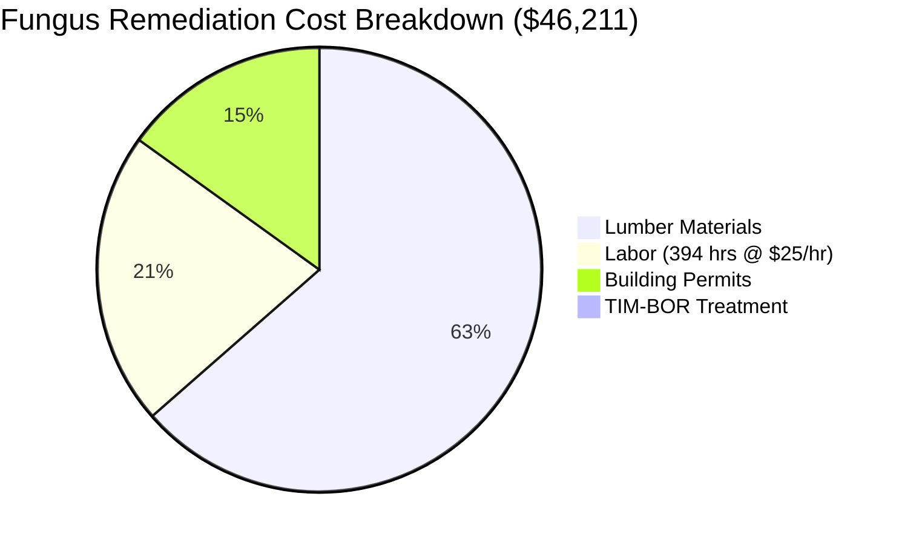

[Back to Master Repair Plan](./master-repair-plan.md)

# Santa Ray Avenue Property - Detailed Cost Breakdown

**Property:** 757 Santa Ray Avenue, Oakland, CA 94610  
**Analysis Date:** August 16, 2025  
**Methodology:** Bottom-up analysis using DIY materials costs + $25/hour labor rates

---

## 📊 EXECUTIVE COST SUMMARY

### TOTAL PROJECT COST: $87,000 - $113,000

| Category | Cost Range | Percentage |
|----------|------------|------------|
| **🐛 Fungus Remediation** | $46,211 | 41-53% |
| **🚨 Property Transfer Compliance** | $12,700 | 11-15% |
| **🛠️ Tools & Equipment** | $7,600-12,100 | 7-13% |
| **🎨 Cosmetic & Upgrades** | $8,500-15,000 | 8-17% |
| **🔧 Infrastructure Systems** | $3,900-7,700 | 3-9% |
| **🏠 Functionality & Comfort** | $3,670-8,170 | 3-9% |
| **💧 Water/Safety DIY Tasks** | $590-1,265 | 1% |

---

## 🐛 FUNGUS REMEDIATION DETAILED BREAKDOWN

### TOTAL COST: $46,211
**Methodology:** Materials from detailed BOM + realistic labor hours at $25/hour

#### **Materials Cost Breakdown**
| Category | Cost | Source |
|----------|------|--------|
| **Lumber (All Types)** | $29,291 | Detailed BOM analysis |
| **TIM-BOR Treatment** | $120 | 25 lb pail |
| **Building Permits** | $6,950 | City requirements |
| **MATERIALS TOTAL** | **$36,361** | |

#### **Labor Analysis - 13 Fungus Locations**
**Total Labor Hours: 394 hours at $25/hour = $9,850**

| Location | Scope | Demo Hours | Build Hours | Finish Hours | Total Hours | Labor Cost |
|----------|-------|------------|-------------|--------------|-------------|------------|
| **Front Porch/Stairs** | Major structural - remove/replace framing beneath concrete | 24 | 40 | 16 | 80 | $2,000 |
| **Side French Doors** | Complete door replacement with framing | 8 | 16 | 8 | 32 | $800 |
| **Lower Rear French Doors** | Complete door replacement with framing | 8 | 16 | 8 | 32 | $800 |
| **Main Unit Window Sashes** | 8 bedroom windows - sash replacement | 16 | 24 | 8 | 48 | $1,200 |
| **Carport Support Posts** | Structural post repair and priming | 12 | 20 | 8 | 40 | $1,000 |
| **Side Deck/Stairs** | Complete deck and stairs reconstruction | 20 | 32 | 8 | 60 | $1,500 |
| **Exterior Window Sashes** | 7 fixed windows - sash replacement | 14 | 21 | 7 | 42 | $1,050 |
| **Rear Wooden Porch** | Porch and framing repair | 12 | 16 | 4 | 32 | $800 |
| **Subfloor/French Doors** | Subfloor and framing repair | 8 | 6 | 2 | 16 | $400 |
| **Side Stairs Handrail** | Simple handrail post repair | 2 | 2 | 0 | 4 | $100 |
| **Carport Framing/Siding** | T1-11 siding replacement | *Included with posts above* | | | | |
| **Debris Removal** | Subarea cleanup and disposal | 8 | 0 | 0 | 8 | $200 |
| **Fascia at Roofline** | Referred to roofing contractor | *Separate quote required* | | | | |

**TOTAL FUNGUS REMEDIATION:** $36,361 (materials) + $9,850 (labor) = **$46,211**

---

## 🚨 PROPERTY TRANSFER COMPLIANCE

### TOTAL COST: $12,700
**Urgency:** CRITICAL - Required before close of escrow

| Item | Contractor | Cost | Timeline |
|------|------------|------|----------|
| **Sewer Lateral Replacement** | Challenge Rooter | $6,900 | 2 days |
| **Sidewalk ADA Compliance** | Challenge Rooter | $5,800 | 2-3 days |

**Dependencies:** Must complete before property title transfer

---

## 🛠️ TOOLS & EQUIPMENT ANALYSIS - COMPREHENSIVE UPDATE

### **NEW ANALYSIS: ALL DIY PROJECTS COVERED**
Previous analysis only covered fungus remediation. Updated to include ALL 7 DIY project categories.

### PURCHASE vs RENTAL COST: $7,600-12,100 (Purchase) / $2,000-4,000 (Rental)

#### **🔋 RYOBI ONE+ ECOSYSTEM ADVANTAGE**
**Your existing Ryobi ONE+ batteries provide significant cost savings**

**🎆 Ryobi ONE+ 6-Tool Combo Kit:** $199 (reg. $299, save $100)
- Covers tools used across ALL 7 project categories
- Drill/driver, impact driver, reciprocating saw, circular saw, multi-tool, LED light
- Includes 1.5Ah + 4.0Ah batteries and charger

#### **Tool Categories by Project Coverage**
| Category | Purchase Cost | Rental Cost | Projects Covered | Usage Frequency |
|----------|---------------|-------------|------------------|------------------|
| **🔋 Universal Power Tools** | $199-400 | $100-200 | ALL 7 projects | Daily |
| **⚡ Electrical Safety** | $100-150 | $25-50 | Electrical, Interior | Critical safety |
| **🏠 Basic Hand Tools** | $200-400 | $75-150 | ALL projects | Daily |
| **🔨 Demolition Tools** | $300-400 | $75-100 | Fungus, Interior | Weekly |
| **⚖️ Structural Support** | $300-450 | $150-200 | Fungus remediation | Load-bearing work |
| **🔍 Assessment Tools** | $100-200 | $25-50 | Fungus, Electrical | TIM-BOR, inspection |
| **📐 Measurement Tools** | $200-300 | $50-75 | ALL projects | Precision work |
| **🧪 Fungus-Specific** | $200-300 | $100-150 | Fungus only | TIM-BOR spraying |

#### **📊 UPDATED PHASED STRATEGY**

**Phase 1 - Universal Tools ($800-1,200):**
- Ryobi ONE+ combo kit: $199
- Essential hand tools: $300-500
- Basic safety equipment: $200-300
- Basic electrical tools: $100-150
- **Covers:** ALL 7 project categories

**Phase 2 - Project-Specific ($600-900):**
- Specialized electrical safety: $100-150
- Exterior tools (ladder, caulking): $200-300
- Interior finishing tools: $200-300
- Plumbing basics: $100-150
- **Covers:** Safety compliance, specialized tasks

**Phase 3 - Fungus Remediation ($2,200-3,200):**
- Advanced demolition: $300-400
- Structural support: $300-450
- Surface preparation: $400-600
- Professional clamping: $800-1,200
- Chemical application: $200-300
- Specialty tools: $500-800
- **Covers:** Major structural work

#### **🎯 RECOMMENDED STRATEGY: Smart Phasing**
- **Start with Universal Tools:** $800-1,200 (enables basic DIY work)
- **Add Project-Specific:** $600-900 (safety compliance)
- **Purchase vs Rent Fungus Tools:** Assess based on timeline
- **Total Smart Approach:** $2,000-4,100 vs $7,600-12,100 full purchase

---

## 🔧 INFRASTRUCTURE SYSTEMS

### TOTAL COST: $3,900-7,700

#### **HVAC System Repairs**
| Item | Type | Cost | Priority |
|------|------|------|----------|
| **Crushed dryer vent** | DIY | $20-40 | 🔴 Critical |
| **Furnace condensation leak** | Contractor | $300-600 | 🟡 High |
| **Noisy furnace fan** | Contractor | $400-800 | 🟡 High |
| **Missing attic ventilation** | Contractor | $500-1,000 | 🟡 High |
| **HVAC TOTAL** | | **$1,220-2,440** | |

#### **Plumbing Infrastructure**
| Item | Type | Cost | Priority |
|------|------|------|----------|
| **Rusted P-traps** | DIY | $30-60 | 🟢 Medium |
| **Kitchen sink leak** | Contractor | $200-400 | 🔴 Critical |
| **Loose toilet** | Contractor | $100-200 | 🔴 Critical |
| **Incompatible pipe connection** | Contractor | $200-400 | 🟡 High |
| **Water heater relief valve** | Contractor | $150-300 | 🟡 High |
| **Water heater drain pans** | Contractor | $300-600 | 🟡 High |
| **PLUMBING TOTAL** | | **$980-1,960** | |

#### **Electrical Systems**
| Item | Type | Cost | Priority |
|------|------|------|----------|
| **Safety hazards (DIY)** | DIY | $60-165 | 🔴 Critical |
| **Subpanel issues** | Contractor | $250-400 | 🔴 Critical |
| **Fire/gas safety** | DIY | $30-60 | 🔴 Critical |
| **ELECTRICAL TOTAL** | | **$340-625** | |

---

## 🏠 FUNCTIONALITY & COMFORT

### TOTAL COST: $3,670-8,170

#### **Interior Functionality**
| Item | Type | Cost | Details |
|------|------|------|---------|
| **Drywall patching** | DIY | $40-80 | Various rooms |
| **Interior painting prep** | DIY | $50-100 | Wall cleaning, taping |
| **Door/cabinet adjustments** | DIY | $20-50 | Hinges, hardware |
| **Flooring refresh** | DIY | $40-170 | Polish, grout repair |
| **New door installation** | DIY | $250-500 | Large corner bedroom |
| **Non-functioning oven** | Contractor | $200-800 | Repair/replace |
| **Failed cooktop burner** | Contractor | $150-300 | Repair igniter |
| **Kitchen exhaust fan** | Contractor | $200-400 | Repair/replace |
| **Non-functioning receptacle** | Contractor | $150-300 | Wiring repair |
| **Chimney cleaning** | Contractor | $200-400 | Professional service |
| **Door/window repairs** | Contractor | $800-1,500 | Multiple locations |
| **INTERIOR TOTAL** | | **$1,900-4,600** | |

#### **Exterior/Drainage**
| Item | Type | Cost | Details |
|------|------|------|---------|
| **Loose downspout** | DIY | $10-20 | Reconnection |
| **Stucco crack repair** | DIY | $20-40 | Sealant application |
| **Loose light fixture** | DIY | $5-10 | Secure mounting |
| **Negative grading** | Contractor | $500-1,200 | Professional regrading |
| **EXTERIOR TOTAL** | | **$535-1,270** | |

#### **Appliance & Specialty Services**
| Item | Type | Cost | Details |
|------|------|------|---------|
| **Various appliance repairs** | Contractor | $350-1,100 | Multiple units |
| **Chimney services** | Contractor | $200-400 | Professional cleaning |
| **SPECIALTY TOTAL** | | **$550-1,500** | |

---

## 🎨 COSMETIC & UPGRADES

### TOTAL COST: $8,500-15,000

#### **Cosmetic Improvements**
| Item | Cost | Details |
|------|------|---------|
| **Floor refinishing** | $1,000-2,500 | Sand and refinish hardwood |
| **Interior paint touch-ups** | $800-1,500 | Repair cracks, repaint |
| **Window screens** | $200-500 | Multiple windows |
| **Vinyl flooring replacement** | $500-1,000 | Utility room, bathroom |
| **COSMETIC TOTAL** | **$2,500-5,500** | |

#### **Electrical Upgrades**
| Item | Cost | Details |
|------|------|---------|
| **Upgrade ungrounded receptacles** | $800-1,500 | Multiple locations |
| **Install AFCI protection** | $600-1,200 | Arc-fault breakers |
| **Additional receptacles** | $400-800 | Convenience outlets |
| **ELECTRICAL UPGRADES TOTAL** | **$1,800-3,500** | |

#### **Quality of Life Improvements**
| Item | Cost | Details |
|------|------|---------|
| **Enhanced lighting** | $500-1,000 | Fixture upgrades |
| **Storage solutions** | $300-800 | Organizational improvements |
| **Landscaping** | $1,000-2,000 | Curb appeal |
| **Security upgrades** | $200-500 | Locks, hardware |
| **QUALITY OF LIFE TOTAL** | **$2,000-4,300** | |

---

## 💧 WATER/SAFETY DIY TASKS

### TOTAL COST: $590-1,265

| System | Tasks | Cost | Professional Alternative | Savings |
|--------|-------|------|-------------------------|---------|
| **Electrical** | Cover plates, receptacles, junction box, GFCI | $60-165 | $300-800 | $240-635 |
| **Fire/Gas Safety** | CO detectors | $30-60 | $170-245 | $140-185 |
| **Plumbing** | P-trap replacement | $30-60 | $270-390 | $240-330 |
| **HVAC** | Dryer vent repair | $20-40 | $185-295 | $165-255 |
| **Critical Leak Repairs** | Kitchen sink, toilet | $300-600 | $600-1,200 | $300-600 |
| **Interior Tasks** | Drywall, painting prep, adjustments | $150-340 | $800-1,500 | $650-1,160 |

**TOTAL DIY SAVINGS: $1,735-3,165**

---

## 🎯 PRIORITY-BASED COST ALLOCATION

### CRITICAL (Days 1-5): $13,590-14,525
- Property transfer compliance: $12,700
- Critical safety DIY: $90-125
- Emergency contractor work: $800-1,200

### HIGH (Week 1-6): $46,211
- Fungus remediation (all materials + labor): $46,211

### MEDIUM (Month 1): $3,670-8,170
- Infrastructure systems: $3,900-7,700
- Functionality improvements: $1,900-4,600
- Exterior/drainage: $535-1,270

### LOW (As Budget Allows): $8,500-15,000
- Cosmetic improvements: $2,500-5,500
- Electrical upgrades: $1,800-3,500
- Quality of life: $2,000-4,300

### TOOLS & EQUIPMENT: $2,000-12,100
- Smart phasing approach recommended: $2,000-4,100
- Comprehensive purchase option: $7,600-12,100
- Rental alternative: $2,000-4,000

---

## 💰 FINANCIAL SUMMARY

### REVISED TOTAL PROJECT COST

| Approach | Cost Range | Savings vs Original |
|----------|------------|-------------------|
| **Comprehensive (Full Tool Purchase)** | $95,000-119,000 | $65,000-81,000 |
| **Recommended (Smart Tool Phasing)** | $87,000-113,000 | $73,000-87,000 |
| **Original Estimate** | $160,000-200,000 | Baseline |

### CONTINGENCY RECOMMENDATIONS
- **Conservative approach:** 15% contingency ($13,000-17,000)
- **Total budget with contingency:** $100,000-130,000
- **Risk mitigation:** Focus on fungus work hidden damage discovery

### COST CONTROL MEASURES
1. **Lock in lumber prices early** (high volatility)
2. **Purchase vs rent analysis** for tools
3. **Phased material delivery** to reduce storage costs
4. **DIY first approach** for immediate confidence building
5. **Professional oversight** for critical structural work

---

## 📋 IMPLEMENTATION STRATEGY

### PHASE 1: IMMEDIATE (Days 1-5)
- Complete property transfer requirements
- Start DIY safety tasks
- Order materials for fungus work
- Secure tool rental/purchase

### PHASE 2: MAJOR REMEDIATION (Days 6-35)
- Execute fungus remediation per licensed pest control requirements
- Complete all 13 locations systematically
- Apply TIM-BOR treatment as required

### PHASE 3: INFRASTRUCTURE (Days 36-50)
- HVAC and plumbing contractor work
- Electrical safety upgrades
- System functionality restoration

### PHASE 4: FUNCTIONALITY (Days 51-80)
- Interior improvements and DIY tasks
- Exterior and drainage work
- Quality control and punch list

### PHASE 5: QUALITY OF LIFE (Months 3-12)
- Cosmetic improvements as budget allows
- Electrical upgrades
- Long-term maintenance setup

**This detailed breakdown provides realistic, actionable cost estimates based on DIY materials costs and reasonable labor rates, resulting in significant savings while maintaining safety and quality standards.**