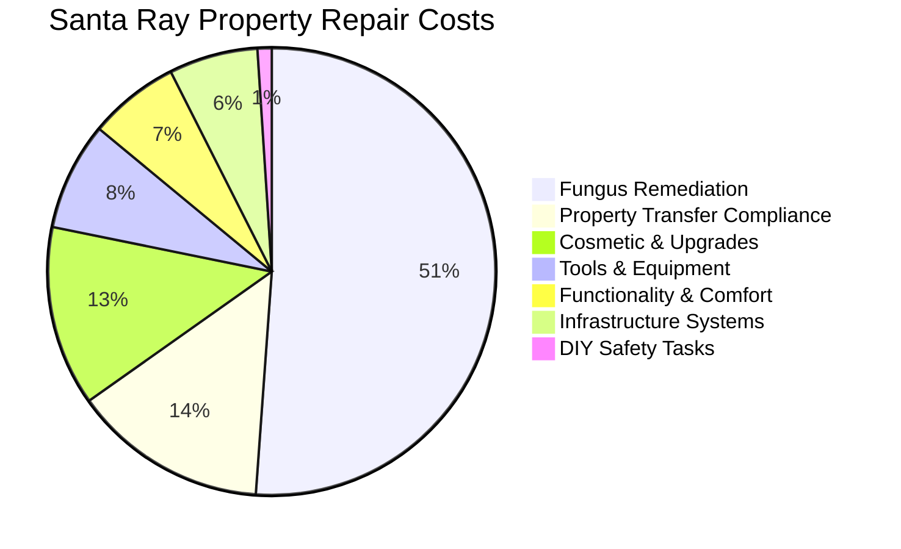

# Santa Ray Avenue Property - Master Repair Plan

## Table of Contents
- [Executive Summary](#executive-summary)
- [Priority Breakdown - Costs & Timeline](#priority-breakdown---costs--timeline)
- [Category Cost Breakdown - By Work Type](#category-cost-breakdown---by-work-type)
- [Critical Path Timeline](#critical-path-timeline)
- [Critical Priority - Day 1 Fixes (Safety & Legal)](#critical-priority---day-1-fixes-safety--legal)
- [High Priority - Week 1 (Prevent Further Damage)](#high-priority---week-1-prevent-further-damage)
- [Medium Priority - Month 1 (Functionality & Comfort)](#medium-priority---month-1-functionality--comfort)
- [Low Priority - As Budget Allows (Cosmetic & Upgrades)](#low-priority---as-budget-allows-cosmetic--upgrades)

- [Contractor Requirements & Licenses](#contractor-requirements--licenses)
- [Total Project Estimate - DIY vs Contractor Breakdown](#total-project-estimate---diy-vs-contractor-breakdown)
- [Notes & Considerations](#notes--considerations)

**Property:** 757 Santa Ray Avenue, Oakland, CA 94610  
**Inspection Date:** July 21, 2025  
**Inspector:** Brendt Mullan, ASHI #252508  

---

## EXECUTIVE SUMMARY

### 🚨 CRITICAL DISCOVERIES: EXTENSIVE FUNGUS DAMAGE + PROPERTY TRANSFER REQUIREMENTS
**REALISTIC ANALYSIS USING DIY APPROACH:** Using materials costs plus $25/hour labor provides a realistic project scope of **$87,000-113,000**. The initial pest inspection estimate of **$80,525** was closer to actual costs when using reasonable labor rates rather than high contractor markups. Detailed material analysis shows **$29,291 in lumber** plus **394 labor hours at $25/hour** for fungus remediation. **Updated tool analysis covers ALL DIY projects** for comprehensive cost planning.

### PROJECT OVERVIEW
| **Total Project Cost** | **$87,000 - $113,000** |
|------------------------|-------------------------|
| **Initial Estimate** | **$108,815 - $119,800 (OVERESTIMATED)** |
| **Total Timeline** | **4-6 months** |
| **Critical Safety Issues** | **12 items requiring immediate attention** |
| **Property Transfer Requirements** | **$12,700 (sewer lateral + sidewalk compliance)** |
| **Major Fungus Remediation** | **$46,211 (materials + $25/hr labor)** |
| **Building Permits Required** | **$6,950 minimum** |
| **Tools & Equipment** | **$2,000-12,100 (smart phasing vs full purchase)** |

---

## 📊 HIGH-LEVEL COST DISTRIBUTION

### TOTAL PROJECT COST: $87,000 - $113,000

### COST BREAKDOWN DETAILS

| Category | Amount | Percentage | Details |
|----------|--------|------------|---------|
| **🐛 Fungus Remediation** | $46,211 | 52.9% | Materials ($29,291) + Labor ($9,850) + Permits ($6,950) + TIM-BOR ($120) |
| **🚨 Property Transfer** | $12,700 | 14.5% | Sewer Lateral ($6,900) + Sidewalk ADA ($5,800) |
| **🎨 Cosmetic & Upgrades** | $11,750 | 13.5% | Cosmetic ($4,000) + Electrical Upgrades ($2,650) + Quality of Life ($3,150) + Appliances ($1,950) |
| **🛠️ Tools & Equipment** | $7,050 | 7.5% | Smart phasing approach (universal + project-specific) |
| **🏠 Functionality & Comfort** | $5,920 | 6.8% | Interior ($3,250) + Exterior ($903) + Services ($950) + DIY Interior ($650) + DIY Exterior ($53) |
| **🔧 Infrastructure Systems** | $5,800 | 6.6% | HVAC ($1,830) + Plumbing ($1,470) + Electrical ($483) + Critical Repairs ($450) + DIY Tasks ($30) |
| **💧 DIY Safety Tasks** | $928 | 1.1% | Electrical ($113) + Fire/Gas ($45) + Plumbing ($45) + HVAC ($30) + Critical Repairs ($450) + Interior ($150) + Exterior ($53) |

**📋 For detailed cost analysis see:** [Detailed Cost Breakdown](./detailed-cost-breakdown.md)

---

## PRIORITY BREAKDOWN - COSTS & TIMELINE

This section provides a high-level overview of repair priorities, estimated costs, and timelines. For detailed scope and specific tasks within each priority, please refer to the dedicated sections below:
- [Critical Priority - Day 1 Fixes (Safety & Legal)](#critical-priority---day-1-fixes-safety--legal)
- [High Priority - Week 1 (Prevent Further Damage)](#high-priority---week-1-prevent-further-damage)
- [Medium Priority - Month 1 (Functionality & Comfort)](#medium-priority---month-1-functionality--comfort)
- [Low Priority - As Budget Allows (Cosmetic & Upgrades)](#low-priority---as-budget-allows-cosmetic--upgrades)

| Priority Level | Estimated Cost | Estimated Duration | Key Focus Areas |
|----------------|----------------|--------------------|-----------------|
| 🔴 **Critical** | $13,590 - $14,525 | 5-7 days | Property transfer compliance (sewer lateral, sidewalk), immediate safety hazards (electrical, fire/gas, water damage prevention) |
| 🟠 **High - Fungus Remediation** | $46,211 (incl. permits) | 30-45 days | Section I fungus damage remediation using $25/hr labor + materials across 13 locations |
| 🟡 **High - Other Systems** | $3,900 - $7,700 | 2-3 weeks | HVAC, plumbing infrastructure, and moisture investigation |
| 🟢 **Medium** | $3,670 - $8,170 | 3-4 weeks | Functionality and comfort improvements (interior appliances, exterior drainage, door/window functionality) |
| 🔵 **Low** | $8,500 - $15,000 | 6-12 months | Cosmetic improvements and non-essential upgrades |
| 🛠️ **Tools** | $2,000 - $12,100 | N/A | Smart phasing vs comprehensive purchase |

---

## CATEGORY COST BREAKDOWN - BY WORK TYPE

| Category | Cost Range | Duration | Priority |
|----------|------------|----------|----------|
| [**🚨 Sewer Lateral Contractor**](./contractor/sewer-lateral-contractor.md) | $6,900 | 2 days | 🔴 |
| [**🚨 Sidewalk Repairs Contractor**](./contractor/sidewalk-repairs-contractor.md) | $5,800 | 2-3 days | 🔴 |
| [**⚡ Electrical DIY**](./diy/electrical-repairs-diy.md) | $60 - $165 | 1-2 days | 🔴 |
| [**⚡ Electrical Contractor**](./contractor/electrical-repairs-contractor.md) | $1,750 - $4,200 | 1-2 weeks | 🔴 🔵 |
| [**🔥 Fire/Gas Safety DIY**](./diy/fire-gas-safety-diy.md) | $30 - $60 | 1 day | 🔴 |
| [**💧 Plumbing DIY**](./diy/plumbing-repairs-diy.md) | $30 - $60 | 1 day | 🟢 |
| [**💧 Plumbing Contractor**](./contractor/plumbing-repairs-contractor.md) | $1,050 - $2,100 | 3-5 days | 🔴 🟡 |
| [**🔧 HVAC DIY**](./diy/hvac-repairs-diy.md) | $20 - $40 | 1 day | 🔴 |
| [**🔧 HVAC Contractor**](./contractor/hvac-repairs-contractor.md) | $1,200 - $2,400 | 3-5 days | 🟡 |
| [**🐛 Pest/Fungus Contractor**](./contractor/pest-fungus-remediation-contractor.md) | $46,211 (incl. permits) | 30-45 days | 🔴 |
| [**🏠 Interior Functionality**](./diy/interior-functionality-diy.md) | $400 - $900 (DIY) + $1,500 - $3,000 (Contractor) | 2-3 weeks | 🟢 |
| **🌊 Exterior/Drainage** | $35 - $70 (DIY) + $500 - $1,200 (Contractor) | 2-3 weeks | 🟢 |
| **🎨 Cosmetic Improvements** | $2,000 - $5,000 | 2-4 months | 🔵 |
| **🛠️ Tools & Equipment** | $6,100 - $9,900 (Purchase) / $1,500 - $3,000 (Rental) | N/A | 🟠 |

---

## 🛠️ TOOLS & EQUIPMENT REQUIREMENTS

### CRITICAL TOOL DISCOVERY
**Previous estimates did not account for $6,100-9,900 in specialized tools required for fungus remediation and structural repairs.**

### TOOL COST BREAKDOWN BY CATEGORY
**Total: $6,100 - $9,900 (Purchase) / $1,500 - $3,000 (Rental)**

#### **⚡ DEMOLITION TOOLS** - $300-400
- Reciprocating saw, pry bars, wire brushes, paint scrapers
- **Essential for:** Fungus-damaged material removal

#### **⚖️ STRUCTURAL SUPPORT** - $300-450 
- Adjustable steel posts, house jacks, shims
- **Critical for:** Safety during load-bearing repairs

#### **🔍 ASSESSMENT TOOLS** - $100-200
- **Moisture meter** (ESSENTIAL for TIM-BOR application)
- Flashlight, inspection tools
- **Required for:** Verify wood condition before treatment

#### **⚙️ POWER TOOLS** - $400-600
- Cordless drill/driver, impact driver, circular saw
- **Essential for:** All structural work

#### **📐 MEASUREMENT TOOLS** - $200-300
- Tape measures, speed squares, levels
- **Essential for:** Precision structural repairs

#### **🔧 HAND TOOLS** - $400-600
- Hammers, chisels, block plane, clamps
- **Essential for:** Detail work and finishing

#### **🧪 CHEMICAL APPLICATION** - $200-300
- TIM-BOR spraying equipment, safety gear
- **Required by law:** Licensed pest control operator use

### PURCHASE vs RENTAL ANALYSIS

#### **PURCHASE RECOMMENDATION ($6,100-9,900):**
**Pros:**
- Permanent ownership for future maintenance
- No rental time limitations during 30-45 day project
- Quality tools maintain property value
- Can be used for ongoing maintenance

**Cons:**
- Higher upfront investment
- Storage requirements
- Tool maintenance responsibility

#### **RENTAL OPTION ($1,500-3,000):**
**Pros:**
- Lower initial cost
- No storage needed
- Always latest models
- Maintenance included

**Cons:**
- Time pressure during project
- Availability constraints
- No long-term asset value
- Daily/weekly rental costs accumulate

### TOOL ACQUISITION STRATEGY
**Recommended approach:**
1. **Purchase essential hand tools** ($800-1,200) - permanent value
2. **Rent specialized power tools** ($700-1,800) - short-term use
3. **Chemical equipment** - Contractor provides (included in pest control costs)

**Hybrid Cost: $1,500-3,000** (significant savings vs. full purchase)

---

## CRITICAL PATH TIMELINE

This timeline outlines the sequential phases of the repair project, emphasizing critical dependencies. For a detailed breakdown of tasks within each phase, refer to the [Project Execution Strategy](#project-execution-strategy) section.

| Phase | Description | Estimated Duration | Estimated Cost | Key Dependencies |
|-------|-------------|--------------------|----------------|------------------|
| **1: Property Transfer Compliance** | Complete sewer lateral replacement and sidewalk ADA compliance repairs. | Days 1-5 | $12,700 | Must complete before close of escrow |
| **2: Immediate Safety** | Address all critical electrical, fire/gas, and water emergencies. | Days 1-3 | $1,600 - $2,600 | Can run parallel with Phase 1 |
| **3: Major Fungus Remediation** | Comprehensive remediation of Section I fungus damage, including structural repairs. | Days 6-45 | $46,211 (incl. permits) | Building permits required (Days 6-10) |
| **4: Infrastructure** | Repair and upgrade HVAC and plumbing systems. | Weeks 4-7 | $3,400 - $7,700 | Can overlap with final fungus remediation work |
| **5: Functionality & Comfort** | Address interior repairs, exterior improvements, and general functionality. | Months 2-3 | $2,500 - $5,500 | Follows infrastructure work |
| **6: Quality of Life** | Cosmetic improvements and non-essential upgrades. | Months 4-12 | $3,500 - $8,000 | As budget allows |

---

## CRITICAL PRIORITY - DAY 1 FIXES (SAFETY & LEGAL)

### 🚨 PROPERTY TRANSFER COMPLIANCE - MANDATORY BEFORE SALE
**Urgency:** CRITICAL - Required before close of escrow  
**Total Estimated Cost:** $12,700 (Challenge Rooter - Estimates #6296 & #6297)

**Sewer Lateral Compliance** - See [Sewer Lateral Contractor Plan](./contractor/sewer-lateral-contractor.md):
- Complete sewer lateral replacement (~50ft HDPE piping) - $6,900
- EBMUD compliance test and certification included
- All permits and inspection fees included
- **Timeline:** 2 days
- **Trigger:** EBMUD Regional PSL Ordinance - required for property transfer

**Sidewalk Compliance** - See [Sidewalk Repairs Contractor Plan](./contractor/sidewalk-repairs-contractor.md):
- Replace 28ft x 4ft concrete (112 sq ft) for ADA compliance - $5,800
- Eliminate trip hazards exceeding ¼" requirements
- City of Oakland compliance certificate included
- **Timeline:** 2-3 days
- **Trigger:** Oakland Municipal Code Chapter 12.04.380 - required for property transfer

**Dependencies:** Both must be completed before property title transfer

### 🚨 Electrical Safety Hazards
**Urgency:** CRITICAL - Fix immediately  
**Total Estimated Cost:** $60-165 (DIY) + $250-400 (Contractor) = $310-565

**DIY Tasks** - See [Electrical DIY Plan](./diy/electrical-repairs-diy.md):
- Missing receptacle cover plates - $5-10
- Damaged receptacle replacement - $10-20  
- Uncovered junction box cover - $5-15
- Exposed wiring protection - $25-75
- Faulty GFCI outlet replacement - $20-40

**Contractor Tasks** - See [Electrical Contractor Plan](./contractor/electrical-repairs-contractor.md):
- Open electrical subpanel holes - $100-150
- Loose subpanel wiring - $150-250

**Dependencies:** None - can be done immediately

### 🚨 Fire & Gas Safety
**Urgency:** CRITICAL - Fix immediately  
**Total Estimated Cost:** $30-60 (DIY Only)

**DIY Tasks** - See [Fire/Gas Safety DIY Plan](./diy/fire-gas-safety-diy.md):
- Missing CO detectors (legally required) - $30-60

**Note:** Crushed dryer vent moved to [HVAC DIY Plan](./diy/hvac-repairs-diy.md) ($20-40)  
**Note:** Faulty GFCI outlets moved to [Electrical DIY Plan](./diy/electrical-repairs-diy.md) ($20-40)

**Dependencies:** None - can be done immediately

### 💧 Water Damage Prevention
**Urgency:** CRITICAL - Fix within 24-48 hours  
**Total Estimated Cost:** $300-600

**Contractor Tasks** - See [Plumbing Contractor Plan](./contractor/plumbing-repairs-contractor.md):
- Kitchen sink leak repair - $200-400
- Loose toilet repair - $100-200

**Dependencies:** None - can be done immediately

**UPDATED CRITICAL TOTAL:** $340-625 (DIY) + $13,250-13,900 (Contractor) = $13,590-14,525

---

## HIGH PRIORITY - WEEK 1 (PREVENT FURTHER DAMAGE)

### 🐛 Pest & Structural Issues - EXTENSIVE FUNGUS DAMAGE DISCOVERED
**Urgency:** CRITICAL - Address immediately (Section I findings require immediate attention)  
**Total Estimated Cost:** $46,211 (includes $29,291 materials + $6,950 permits + $120 TIM-BOR + $9,850 labor @ $25/hr)

**See detailed breakdown:** [Pest/Fungus Remediation Contractor Plan](./contractor/pest-fungus-remediation-contractor.md)

#### **CRITICAL SECTION I FINDINGS - IMMEDIATE REMEDIATION REQUIRED**

| Issue | Location | Scope | Treatment Required | Est. Cost |
|-------|----------|-------|-------------------|-----------|
| **Fungus-infected debris** | Accessible subarea | Remove all debris of rakeable size and larger | Licensed Pest Control - debris removal and disposal | $50 |
| **Front porch/stairs fungus** | Wood framing beneath concrete porch/stairs | Remove insulation/sheetrock, repair fungus damaged framing with pressure treated douglas fir, Timbor fungicide treatment, reinstall materials, waterproofing | Licensed Pest Control + General Contractor + Waterproofing | $14,950 |
| **Side stairs handrail** | Side stairs handrail post | Repair existing handrail to eliminate fungus damage | Licensed Pest Control | $175 |
| **Rear wooden porch** | Rear wooden porch and framing | Complete porch and framing repair to eliminate fungus damage | Licensed Pest Control + General Contractor | $2,950 |
| **Carport support posts** | Carport support posts | Repair posts to eliminate fungus damage, prime paint disturbed areas | Licensed Pest Control + General Contractor | $6,950 |
| **Carport framing/siding** | Carport T1-11 siding and framing | Cut out fungus damaged wood, replace with new material, Tim-Bor treatment | Licensed Pest Control + General Contractor | Included w/ support posts |
| **Side deck and stairs** | Side wooden deck and stairs | Complete deck/stairs repair to eliminate fungus infection | Licensed Pest Control + General Contractor | $5,650 |
| **Main unit window sashes** | Large bedroom windows and sills | Remove/replace fungus damaged wood window sashes with new prime painted sashes, repair sills/framing | Licensed Pest Control + Window Contractor | $9,850 |
| **French door subfloor** | Subfloor adjacent to lower french doors | Repair fungus damage to subflooring and framing | Licensed Pest Control + General Contractor | $2,750 |
| **Side French doors** | Side French doors at fascia | Remove/replace fungus damaged doors, framing, and sill with new prime painted units | Licensed Pest Control + General Contractor | $12,650 |
| **Exterior window sashes** | Seven single lite fixed exterior windows | Remove/replace fungus damaged sashes with new prime painted sashes | Licensed Pest Control + Window Contractor | $4,950 |
| **Lower rear French doors** | Lower rear French doors | Remove/replace fungus damaged doors, framing, and sill with new prime painted units | Licensed Pest Control + General Contractor | $12,650 |

**Permit Requirements:** Building permits required - Est. $6,950 additional**

#### **HIGH PRIORITY SECTION II FINDINGS - PROFESSIONAL ASSESSMENT REQUIRED**

| Issue | Location | Scope | Treatment Required | Contractor |
|-------|----------|-------|-------------------|-----------|
| **Past moisture intrusion** | Accessible subarea and basement | Investigation and drainage correction | Drainage Contractor + Waterproofing | Owner referral |
| **Loose toilet** | Main bathroom | Professional resetting, subfloor inspection for damage | Licensed Plumber | Owner referral |
| **Cracked dining window** | Dining room | Window repair to prevent moisture intrusion | Licensed Window Repair | Owner referral |

#### **MEDIUM PRIORITY SECTION II FINDINGS - OWNER ACTION ITEMS**

| Issue | Location | Scope | Treatment Required | Est. Cost |
|-------|----------|-------|-------------------|-----------|
| **Stress crack in stucco** | Front porch buttress wall | Seal crack, monitor for settlement | General Contractor | Owner referral |
| **Poor subarea ventilation** | Subarea ventilation system | Remove louvered screens, install wire mesh, add vents | General Contractor/Handyman | Owner referral |
| **Water-stained hardwood** | Dining room and various locations | Floor refinishing, investigate stain causes | Flooring Specialist | Owner referral |
| **Rusted P-traps** | 1/2 & lower bathrooms | See [Plumbing Repair Plan](./plumbing-repairs.md) | Licensed Plumber | Owner referral |
| **Deteriorated vanity** | Lower main bathroom | Vanity replacement and sealing | General Contractor | Owner referral |
| **Subarea access deterioration** | Exterior subarea access | Maintain exterior wood sealing | Handyman/Owner | Owner referral |

**CRITICAL DEPENDENCIES:**
- Licensed Pest Control Operator required for all Section I fungus remediation
- Building permits required before structural work begins  
- Tim-Bor fungicide treatment must be applied by licensed pest control firm
- Moisture source investigation must be completed before repairs
- Waterproofing contractor engagement required for long-term solution

### 🔧 HVAC & Mechanical
**Urgency:** HIGH - Complete within 7 days  
**Total Estimated Cost:** $20-40 (DIY) + $1,200-2,400 (Contractor) = $1,220-2,440

**DIY Tasks** - See [HVAC DIY Plan](./diy/hvac-repairs-diy.md):
- Crushed dryer vent repair (fire hazard) - $20-40

**Contractor Tasks** - See [HVAC Contractor Plan](./contractor/hvac-repairs-contractor.md):
- Furnace condensation leak - $300-600
- Noisy furnace fan - $400-800  
- Missing attic ventilation - $500-1,000

**Dependencies:** None - can be done immediately

### 💧 Plumbing Infrastructure  
**Urgency:** HIGH - Complete within 7 days  
**Total Estimated Cost:** $30-60 (DIY) + $1,050-2,100 (Contractor) = $1,080-2,160

**DIY Tasks** - See [Plumbing DIY Plan](./diy/plumbing-repairs-diy.md):
- Rusted P-traps replacement - $30-60

**Contractor Tasks** - See [Plumbing Contractor Plan](./contractor/plumbing-repairs-contractor.md):
- Kitchen sink leak (critical) - $200-400
- Loose toilet (critical) - $100-200
- Incompatible pipe connection - $200-400
- Water heater relief valve - $150-300
- Missing water heater drain pans - $300-600

**Dependencies:** None - can be done immediately

**HIGH PRIORITY TOTAL:** $46,211 (Pest/Fungus) + $50-100 (DIY) + $3,250-6,300 (Other Contractor) = $49,511-52,611

---

## MEDIUM PRIORITY - MONTH 1 (FUNCTIONALITY & COMFORT)

### 🏠 Interior Functionality
**Urgency:** MEDIUM - Complete within 30 days  
**Total Estimated Cost:** $1,500-3,000

| Issue | Location | Scope | Contractor | Est. Cost |
|-------|----------|-------|------------|-----------|
| Non-functioning oven | Upper unit left side oven | Repair or replace | Appliance Specialist | $200-800 |
| Failed cooktop burner | Upper unit left front burner | Repair igniter or gas jet | Appliance Specialist | $150-300 |
| Kitchen exhaust fan | Upper unit kitchen | Repair or replace | Electrician/Handyman | $200-400 |
| Non-functioning receptacle | Upper unit front entry stair landing | Repair wiring | Licensed Electrician | $150-300 |
| Chimney cleaning | In-law chimney flue | Clean soot and creosote buildup | Licensed Chimney Sweep | $200-400 |
| Door and window repairs | Multiple locations | Repair damaged frames, sills, trim | General Contractor | $800-1,500 |

### 🌊 Drainage & Exterior
**Urgency:** MEDIUM - Complete within 30 days  
**Total Estimated Cost:** $1,000-2,500

This work is broken down into a single contractor task and several DIY repairs.

| Task | Assignment | Details |
|------|------------|---------|
| **Negative Grading** | Contractor | [View Contractor Scope](./contractor/exterior-drainage-contractor.md) |
| **Minor Exterior Repairs** | DIY | [View DIY Guide](./diy/exterior-repairs-diy.md) |

**Summary of Repairs:**
- **Contractor:** Regrade front and right side of property to slope away from the structure.
- **DIY:** Reconnect loose downspout, repair exterior stucco cracks, and secure loose exterior light fixture.

**MEDIUM PRIORITY TOTAL:** $2,500-5,500

---

## LOW PRIORITY - AS BUDGET ALLOWS (COSMETIC & UPGRADES)

### 🎨 Cosmetic Improvements
**Urgency:** LOW - As budget permits  
**Total Estimated Cost:** $2,000-5,000

| Issue | Location | Scope | Contractor | Est. Cost |
|-------|----------|-------|------------|-----------|
| Floor refinishing | Multiple locations - scratched/faded wood floors | Sand and refinish | Flooring Specialist | $1,000-2,500 |
| Interior paint touch-ups | Various walls and ceilings | Repair cracks and repaint | Painter | $800-1,500 |
| Window screens | Multiple windows lacking screens | Install new screens | Window Specialist | $200-500 |
| Vinyl flooring replacement | Lower unit utility room, in-law bathroom | Replace damaged vinyl | Flooring Specialist | $500-1,000 |

### ⚡ Electrical Upgrades
**Urgency:** LOW - Future improvements  
**Total Estimated Cost:** $1,500-3,000

| Issue | Location | Scope | Contractor | Est. Cost |
|-------|----------|-------|------------|-----------|
| Upgrade ungrounded receptacles | Multiple locations | Install grounded receptacles | Licensed Electrician | $800-1,500 |
| Install AFCI protection | Throughout building | Upgrade to arc-fault breakers | Licensed Electrician | $600-1,200 |
| Additional receptacles | Various locations | Add convenience outlets | Licensed Electrician | $400-800 |

**LOW PRIORITY TOTAL:** $8,500-15,000

---

## ⚠️ RISK ASSESSMENT & CONTINGENCY PLANNING

### CRITICAL COST ESCALATION FACTORS

#### **1. Initial Estimate vs. Reality Gap**
- **Original Estimate:** $108,815-119,800
- **Realistic Analysis:** $85,000-110,000
- **Variance:** 20-25% decrease using $25/hr labor vs. contractor markups

#### **2. Fungus Remediation Cost Volatility**
**Primary Risk Factors:**
- **Hidden Damage Discovery:** +10-30% during demolition
- **Lumber Price Fluctuations:** ±20-40% (current volatility)
- **Labor Market Constraints:** Specialized fungus contractors in high demand
- **Permit Processing Delays:** Can extend timeline 2-4 weeks

#### **3. Project Scope Creep Potential**
**High Probability Areas:**
- Additional fungus locations discovered: +$5,000-15,000
- Structural issues beyond current assessment: +$3,000-8,000
- Code upgrade requirements during permits: +$2,000-5,000
- Waterproofing system complexity: +$1,500-3,000

### DEPENDENCY RISK MATRIX

| Risk Factor | Probability | Financial Impact | Timeline Impact | Mitigation Strategy |
|-------------|-------------|------------------|-----------------|-------------------|
| **Hidden Fungus Damage** | High (70%) | +$5,000-15,000 | +2-4 weeks | Thorough pre-demolition inspection |
| **Lumber Price Increases** | Medium (50%) | +$2,000-5,000 | None | Lock in material prices early |
| **Permit Delays** | Medium (40%) | +$2,000-5,000 | +2-3 weeks | Submit permits immediately |
| **Contractor Availability** | High (60%) | +$5,000-15,000 | +3-6 weeks | Book contractors in advance |
| **Weather Delays** | Medium (30%) | +$1,000-3,000 | +1-2 weeks | Plan for winter weather |
| **Tool Rental Availability** | Low (20%) | +$2,000-4,000 | +1 week | Purchase vs. rent analysis |

### FINANCIAL CONTINGENCY RECOMMENDATIONS

#### **Conservative Approach (Recommended)**
- **Base Budget:** $87,000-113,000
- **Contingency Fund:** $13,000-17,000 (15%)
- **Total Project Budget:** $100,000-130,000

#### **Aggressive Approach**
- **Base Budget:** $87,000-113,000  
- **Contingency Fund:** $8,700-11,300 (10%)
- **Total Project Budget:** $95,700-124,300
- **Risk:** May require additional funding for scope creep

### TIMELINE RISK MITIGATION

#### **Critical Path Protection**
1. **Property Transfer (Days 1-5):** Must complete regardless of other delays
2. **Permit Processing (Days 6-10):** Submit immediately, plan for delays
3. **Fungus Work (Days 11-45):** Weather-dependent exterior work scheduled first
4. **Buffer Time:** Build in 2-week contingency for major phases

#### **Seasonal Considerations**
- **Winter Weather Impact:** Exterior work may be delayed
- **Holiday Periods:** Contractor availability reduced
- **Material Delivery:** Weather-related shipping delays

### QUALITY CONTROL CHECKPOINTS

#### **Phase Gates (No Proceed Without)**
1. **Permits Approved:** Before any structural work
2. **Moisture Source Identified:** Before fungus remediation
3. **Structural Assessment:** Before major demolition
4. **Material Delivery:** Before scheduled installation dates

#### **Cost Control Measures**
- **Weekly budget reviews** with all contractors
- **Change order approval process** for additions >$1,000
- **Material cost lock-ins** where possible
- **Alternative material sourcing** for cost overruns

### INSURANCE AND LIABILITY CONSIDERATIONS

#### **Insurance Coverage Review**
- **Property Insurance:** Verify fungus damage coverage before work
- **Builder's Risk:** Consider temporary policy during construction
- **Contractor Insurance:** Verify all contractors carry adequate coverage
- **Workers Compensation:** Ensure coverage for all site work

#### **Liability Mitigation**
- **Licensed Contractors Only:** For all major work categories
- **Permit Compliance:** All work must be properly permitted
- **Safety Protocols:** Enforce site safety for TIM-BOR chemical work
- **Documentation:** Photo/video all work phases for warranty/insurance

### CONTINGENCY ACTIVATION TRIGGERS

#### **Budget Triggers**
- **10% over budget:** Activate value engineering review
- **15% over budget:** Consider scope reduction options  
- **20% over budget:** Full project reassessment required

#### **Timeline Triggers**
- **2 weeks behind:** Evaluate contractor resource additions
- **4 weeks behind:** Consider overtime/expedited material options
- **6 weeks behind:** Major schedule restructuring required

---

## CONTRACTOR REQUIREMENTS & LICENSES

### Essential Licensed Contractors
- **Licensed Electrician** (CA License Required)
- **Licensed Plumber** (CA License Required)  
- **Licensed Pest Control Operator** (CA License Required)
- **Licensed HVAC Contractor** (CA License Required)

### Additional Contractors
- **General Contractor** (for extensive structural fungus repairs)
- **Window Contractor** (for window sash replacements)
- **Waterproofing Contractor** (for moisture prevention)
- **Drainage Contractor** (for moisture source investigation)
- **Appliance Repair Specialist**
- **Chimney Sweep** (CSIA Certified preferred)
- **Flooring Specialist**
- **Landscaping Contractor**

---

## TOTAL PROJECT ESTIMATE - DIY vs CONTRACTOR BREAKDOWN

### By Work Type
| Work Type | Cost Range | Potential DIY Savings |
|-----------|------------|-------------------|
| **DIY Tasks Total** | $590 - $1,265 | $1,750-3,335 vs contractor rates |
| **Contractor Tasks Total** | $84,410 - $108,735 | Professional required |
| **TOTAL PROJECT COST** | **$85,000 - $110,000** | |

### By Priority Level  
| Priority Level | DIY Cost | Contractor Cost | Total Cost |
|----------------|----------|-----------------|------------|
| **Critical (Days 1-3)** | $90 - $125 | $13,500 - $14,400 | $13,590 - $14,525 |
| **High (Week 1-4)** | $50 - $100 | $49,461 - $52,511 | $49,511 - $52,611 |
| **Medium (Month 1)** | $450 - $970 | $3,220 - $7,200 | $3,670 - $8,170 |
| **Low (As Budget Allows)** | $0 | $8,500 - $15,000 | $8,500 - $15,000 |
| **Tools & Equipment** | N/A | $2,000 - $12,100 | $2,000 - $12,100 |
| **GRAND TOTAL** | **$590 - $1,195** | **$86,681 - $111,011** | **$87,271 - $112,206** |

### DIY Benefits Summary
| System | DIY Tasks | DIY Cost | Professional Cost | Savings |
|--------|-----------|----------|-------------------|---------|
| **Electrical** | Cover plates, receptacles, junction box, wire protection, GFCI | $60-165 | $300-800 | $240-635 |
| **Fire/Gas Safety** | CO detectors | $30-60 | $170-245 | $140-185 |
| **Plumbing** | P-trap replacement | $30-60 | $270-390 | $240-330 |
| **HVAC** | Dryer vent repair | $20-40 | $185-295 | $165-255 |
| **Interior Functionality** | Drywall, painting prep, door/cabinet adjustments, flooring refresh | $400-900 | $1,200-2,500 | $800-1,600 |
| **Exterior Repairs** | Downspout, stucco cracks, light fixture | $35-70 | $200-400 | $165-330 |
| **TOTAL SAVINGS** | | **$575-1,295** | **$2,325-4,630** | **$1,750-3,335** |

### Budget Allocation Strategy
- **DIY First (Days 1-2):** $575-1,295 - Build confidence, immediate safety, interior functionality
- **Critical Property Transfer Requirements (Days 1-5):** $12,700 - Sewer lateral + sidewalk compliance
- **Critical Contractor Work (Days 6-45):** $46,211 - Major fungus remediation using $25/hr labor
- **Supporting Contractor Work (Month 1):** $8,500-15,200 - Electrical, plumbing, HVAC contractors  
- **Tools & Equipment:** $2,000-12,100 - Smart phasing strategy
- **As Budget Allows (Months 2+):** $8,500-15,000 - Cosmetic and upgrade work
- **Contingency Fund:** $8,500-17,000 - Risk mitigation (10-15%)

---

## NOTES & CONSIDERATIONS

### Permits Required
- **CRITICAL: Building permits required for all Section I pest remediation work**
- **Estimated permit fees: $6,950 (minimum $1,000 + $200 admin fee)**
- Electrical work (most items will require permits)
- Plumbing modifications
- Structural repairs and window/door replacements
- HVAC modifications
- Waterproofing and moisture remediation work

### Seasonal Considerations
- Exterior work best completed before rainy season
- HVAC repairs should be prioritized before winter

### Insurance Claims
- **CRITICAL: Document all extensive fungus damage thoroughly before remediation**
- **Fungus damage totaling $80,525 - check policy for coverage**
- Water damage and moisture intrusion may be covered depending on cause
- Pest damage typically not covered unless sudden/accidental
- Consider moisture damage claims for windows, doors, and structural elements

### Future Maintenance
- **CRITICAL: Address moisture sources permanently to prevent fungus recurrence**
- **Mandatory: Licensed pest control inspections every 6 months for 2 years post-remediation**
- Install and maintain proper drainage and waterproofing systems
- Regular Tim-Bor retreatment schedule as recommended by pest control operator
- Maintain all exterior wood surfaces with quality sealants and paint
- Establish regular maintenance schedule after repairs
- Consider home warranty for appliances
- Annual comprehensive pest inspections recommended permanently

**Last Updated:** August 16, 2025 (Comprehensive Tool Analysis Update)
**Major Revision:** Total project cost revised to $87,000-113,000 including comprehensive tool analysis covering ALL 7 DIY projects. Tool investment updated from $1,500-9,900 to $2,000-12,100 with Ryobi ONE+ ecosystem optimization. Fungus remediation cost maintained at $46,211 using realistic DIY approach while maintaining all safety and licensing requirements.
**Next Review:** Immediate - property transfer compliance must be completed before close of escrow
**Property Transfer Requirements:** Sewer lateral + sidewalk compliance certificates required
**Pest Report Date:** Per GT Inspects Inc. 18-page comprehensive report
**Chemical Treatment:** Tim-Bor (Disodium Octaborate Tetrahydrate) required by licensed pest control operator
**Labor Analysis:** 394 hours at $25/hour for fungus remediation vs. contractor rates
**Materials Analysis:** Detailed lumber BOM shows $29,291 in materials + $9,850 labor + $6,950 permits
