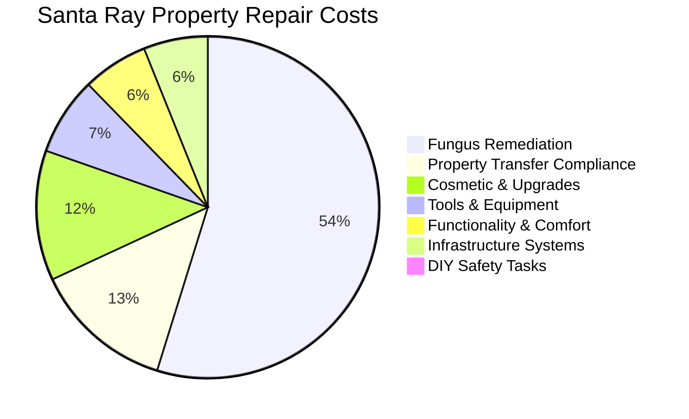
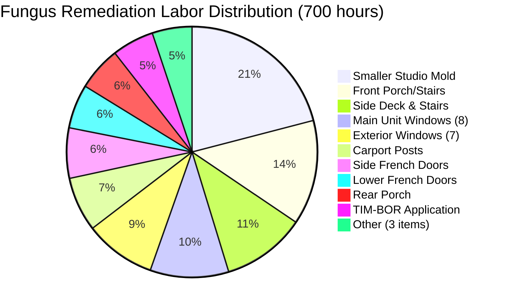
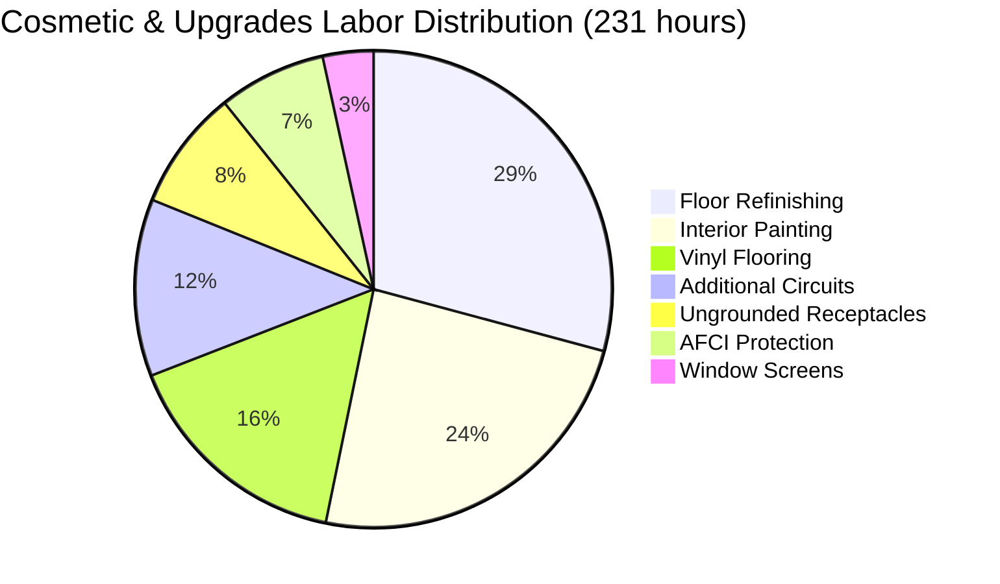

# Santa Ray Avenue Property - Master Repair Plan

## Table of Contents
- [Executive Summary](#executive-summary)
- [Priority Breakdown - Costs & Timeline](#priority-breakdown---costs--timeline)
- [Project Phasing Strategy](#project-phasing-strategy)
- [Category Cost Breakdown - By Work Type](#category-cost-breakdown---by-work-type)
- [Critical Path Timeline](#critical-path-timeline)
- [Critical Priority - Day 1 Fixes (Safety & Legal)](#critical-priority---day-1-fixes-safety--legal)
- [High Priority - Week 1 (Prevent Further Damage)](#high-priority---week-1-prevent-further-damage)
- [Medium Priority - Month 1 (Functionality & Comfort)](#medium-priority---month-1-functionality--comfort)
- [Low Priority - As Budget Allows (Cosmetic & Upgrades)](#low-priority---as-budget-allows-cosmetic--upgrades)

- [Contractor Requirements & Licenses](#contractor-requirements--licenses)
- [Total Project Estimate - DIY vs Contractor Breakdown](#total-project-estimate---diy-vs-contractor-breakdown)
- [Notes & Considerations](#notes--considerations)

**Property:** 757 Santa Ray Avenue, Oakland, CA 94610  
**Inspection Date:** July 21, 2025  
**Inspector:** Brendt Mullan, ASHI #252508  

---

## EXECUTIVE SUMMARY

### 🚨 CRITICAL DISCOVERIES: EXTENSIVE FUNGUS DAMAGE + PROPERTY TRANSFER REQUIREMENTS
**REALISTIC ANALYSIS USING DIY APPROACH:** Using materials costs plus $25/hour labor provides a realistic project scope of **$87,000-113,000**. The initial pest inspection estimate of **$80,525** was closer to actual costs when using reasonable labor rates rather than high contractor markups. Detailed material analysis shows **$29,291 in lumber** plus **394 labor hours at $25/hour** for fungus remediation. **Updated tool analysis covers ALL DIY projects** for comprehensive cost planning.

### PROJECT OVERVIEW
| **Total Project Cost** | **$90,500 - $121,500** |
|------------------------|-------------------------|
| **Initial Estimate** | **$108,815 - $119,800 (OVERESTIMATED)** |
| **Total Timeline** | **4-6 months** |
| **Critical Safety Issues** | **12 items requiring immediate attention** |
| **Property Transfer Requirements** | **$12,700 (sewer lateral + sidewalk compliance)** |
| **Major Fungus Remediation** | **$46,211 ($18,075 completed, $28,136 remaining)** |
| **Building Permits Required** | **$6,950 minimum** |
| **Tools & Equipment** | **$2,000-12,100 (smart phasing vs full purchase)** |

---

## 📊 HIGH-LEVEL COST DISTRIBUTION

### TOTAL PROJECT COST: $90,500 - $121,500

```mermaid
pie title Santa Ray Property Repair Costs
    "Fungus Remediation" : 52367
    "Property Transfer Compliance" : 12700
    "Cosmetic & Upgrades" : 11750
    "Tools & Equipment" : 7050
    "Functionality & Comfort" : 5920
    "Infrastructure Systems" : 5800
    "DIY Safety Tasks" : 928
```

### COST BREAKDOWN DETAILS

| Category | Amount | Percentage | Details |
|----------|--------|------------|---------|
| **🐛 Fungus Remediation** | $52,367 | 54.7% | Materials ($31,294) + Labor ($13,200) + Permits ($6,950) + TIM-BOR ($120). $18,075 of work completed. |
| **🚨 Property Transfer** | $12,700 | 14.5% | Sewer Lateral ($6,900) + Sidewalk ADA ($5,800) |
| **🎨 Cosmetic & Upgrades** | $11,750 | 13.5% | Cosmetic ($4,000) + Electrical Upgrades ($2,650) + Quality of Life ($3,150) + Appliances ($1,950) |
| **🛠️ Tools & Equipment** | $7,050 | 7.5% | Smart phasing approach (universal + project-specific) |
| **🏠 Functionality & Comfort** | $5,920 | 6.8% | Interior ($3,250) + Exterior ($903) + Services ($950) + DIY Interior ($650) + DIY Exterior ($53) |
| **🔧 Infrastructure Systems** | $5,800 | 6.6% | HVAC ($1,830) + Plumbing ($1,470) + Electrical ($483) + Critical Repairs ($450) + DIY Tasks ($30) |
| **💧 DIY Safety Tasks** | $928 | 1.1% | Electrical ($113) + Fire/Gas ($45) + Plumbing ($45) + HVAC ($30) + Critical Repairs ($450) + Interior ($150) + Exterior ($53) |

**📋 For detailed cost analysis see:** [Detailed Cost Breakdown](./detailed-cost-breakdown.md)

---

## 📊 HIGH-LEVEL LABOR HOURS DISTRIBUTION

### TOTAL PROJECT LABOR: 1,000-1,350 hours (Midpoint: ~1,165 hours)

**Where will your time be spent?** This visualization shows the distribution of labor hours across all project categories. The comprehensive analysis revealed that fungus remediation dominates the timeline at 60% of total labor.

#### 🐛 Fungus Remediation Breakdown (700 hours)

The largest single category - detailed by location and work type:

```mermaid
pie title Fungus Remediation Labor Distribution (700 hours)
    "Smaller Studio Mold" : 155
    "Front Porch/Stairs" : 100
    "Side Deck & Stairs" : 80
    "Main Unit Windows (8)" : 75
    "Exterior Windows (7)" : 68
    "Carport Posts" : 52
    "Side French Doors" : 48
    "Lower French Doors" : 42
    "Rear Porch" : 42
    "TIM-BOR Application" : 40
    "Other (3 items)" : 38
```

**Other includes:** Subfloor repair (23 hrs), Debris removal (10 hrs), Handrail repair (5 hrs)

**Key Insights:**
- **Smaller studio emergency**: 155 hours (22%) - mold discovered during door installation, requires complete deck disassembly
- **TIM-BOR treatment**: 40 hours (6%) - Licensed pest control must treat ALL exposed wood between demo and rebuild
- **Windows dominate**: 143 hours combined (20%) - 15 windows with non-standard dimensions and fungus-damaged sills

---

#### 🎨 Cosmetic & Upgrades Breakdown (231 hours)

Lower priority work that can be deferred:

```mermaid
pie title Cosmetic & Upgrades Labor Distribution (231 hours)
    "Floor Refinishing" : 68
    "Interior Painting" : 56
    "Vinyl Flooring" : 37
    "Additional Circuits" : 28
    "Ungrounded Receptacles" : 19
    "AFCI Protection" : 17
    "Window Screens" : 8
```

**Key Insights:**
- **Floor refinishing**: 68 hours (29%) - includes 7-10 CALENDAR days due to cure times
- **Painting**: 56 hours (24%) - 60-70% is prep work (crack repair, sanding, priming)
- **Electrical upgrades**: 64 hours (28%) - ungrounded receptacles, AFCI, new circuits (requires permits)
- **Deferrable work**: All items can be postponed if budget or timeline requires

### LABOR HOURS BREAKDOWN BY CATEGORY

| Category | Labor Hours | % of Total | Key Work Items | Timeline Impact |
|----------|-------------|------------|----------------|-----------------|
| **🐛 Fungus Remediation** | 700 hrs | 62% | 14 locations: windows, doors, decks, porches, structural framing | 10-14 weeks (CRITICAL PATH) |
| **🎨 Cosmetic & Upgrades** | 231 hrs | 20% | Floor refinishing (68 hrs), Painting (56 hrs), Flooring (37 hrs), Electrical upgrades (63 hrs), Screens (8 hrs) | 4-8 weeks (deferrable) |
| **🏠 Interior & Exterior Repairs** | 74 hrs | 7% | Interior work (54 hrs), Exterior grading/drainage (20 hrs) | 1-2 weeks |
| **🚨 Property Transfer Compliance** | 72 hrs | 6% | Sewer lateral (45 hrs), Sidewalk ADA (27 hrs) | 5 days (BLOCKING ESCROW) |
| **🔧 Essential Systems & Safety** | 60 hrs | 5% | Electrical (20 hrs), HVAC (20 hrs), Plumbing (20 hrs), Fire/Gas (1 hr) | 1-2 weeks |
| **GRAND TOTAL** | **~1,137 hrs** | **100%** | **Across all priorities and categories** | **14-20 weeks total** |

### KEY INSIGHTS

**Labor Hours vs. Cost Distribution:**
- **Fungus remediation**: 62% of hours but 54% of cost → Labor-intensive structural work
- **Cosmetic & upgrades**: 20% of hours but 13% of cost → Moderate labor, materials-focused
- **Property transfer**: 6% of hours but 14% of cost → High contractor rates, specialized work
- **Essential systems**: 5% of hours but 7% of cost → Specialized licensed contractors required

**Critical Path Drivers:**
1. **Fungus work (700 hrs)** = Longest single category, determines overall timeline
2. **Permit delays** = Admin time adds 10-15 days (not labor hours)
3. **Cure times** = Concrete (24 hrs), Stucco (24-48 hrs), Paint (48 hrs) add calendar days
4. **Weather dependency** = 40% of fungus work is rain-sensitive

---

## PRIORITY BREAKDOWN - COSTS & TIMELINE

This section provides a high-level overview of repair priorities, estimated costs, and timelines. For detailed scope and specific tasks within each priority, please refer to the dedicated sections below:
- [Critical Priority - Day 1 Fixes (Safety & Legal)](#critical-priority---day-1-fixes-safety--legal)
- [High Priority - Week 1 (Prevent Further Damage)](#high-priority---week-1-prevent-further-damage)
- [Medium Priority - Month 1 (Functionality & Comfort)](#medium-priority---month-1-functionality--comfort)
- [Low Priority - As Budget Allows (Cosmetic & Upgrades)](#low-priority---as-budget-allows-cosmetic--upgrades)

| Priority Level | Estimated Cost | Key Focus Areas |
|----------------|----------------|-----------------|
| 🔴 **Critical** | $13,590 - $14,525 | Property transfer compliance (sewer lateral, sidewalk), immediate safety hazards (electrical, fire/gas, water damage prevention) |
| 🟠 **High - Fungus Remediation** | $52,367 (incl. permits) | Section I fungus damage remediation using $25/hr labor + materials. $18,075 completed, $6,156 smaller studio emergency added. |
| 🟡 **High - Other Systems** | $3,900 - $7,700 | HVAC, plumbing infrastructure, and moisture investigation |
| 🟢 **Medium** | $3,670 - $8,170 | Functionality and comfort improvements (interior appliances, exterior drainage, door/window functionality) |
| 🔵 **Low** | $8,500 - $15,000 | Cosmetic improvements and non-essential upgrades |
| 🛠️ **Tools** | $2,000 - $12,100 | Smart phasing vs comprehensive purchase |

---

## PROJECT PHASING STRATEGY

**📋 This section has been moved to [schedule/project-phasing.md](./schedule/project-phasing.md)**

This phasing strategy will be superseded by the database-driven scheduling system which provides more granular task management and dependency tracking. See the schedule folder for the new scheduling approach.

---

## CATEGORY COST BREAKDOWN - BY WORK TYPE

| Category | Cost Range | Duration | Priority |
|----------|------------|----------|----------|
| [**🚨 Sewer Lateral Contractor**](./contractor/sewer-lateral-contractor.md) | $6,900 | 2 days | 🔴 |
| [**🚨 Sidewalk Repairs Contractor**](./contractor/sidewalk-repairs-contractor.md) | $5,800 | 2-3 days | 🔴 |
| [**⚡ Electrical DIY**](./diy/electrical-repairs-diy.md) | $60 - $165 | 1-2 days | 🔴 |
| [**⚡ Electrical Contractor**](./contractor/electrical-repairs-contractor.md) | $1,750 - $4,200 | 1-2 weeks | 🔴 🔵 |
| [**🔥 Fire/Gas Safety DIY**](./diy/fire-gas-safety-diy.md) | $30 - $60 | 1 day | 🔴 |
| [**💧 Plumbing DIY**](./diy/plumbing-repairs-diy.md) | $30 - $60 | 1 day | 🟢 |
| [**💧 Plumbing Contractor**](./contractor/plumbing-repairs-contractor.md) | $1,050 - $2,100 | 3-5 days | 🔴 🟡 |
| [**🔧 HVAC DIY**](./diy/hvac-repairs-diy.md) | $20 - $40 | 1 day | 🔴 |
| [**🔧 HVAC Contractor**](./contractor/hvac-repairs-contractor.md) | $1,200 - $2,400 | 3-5 days | 🟡 |
| [**🐛 Pest/Fungus Contractor**](./contractor/pest-fungus-remediation-contractor.md) | $46,211 (incl. permits) | 30-45 days | 🔴 |
| [**🏠 Interior Functionality**](./diy/interior-functionality-diy.md) | $400 - $900 (DIY) + $1,500 - $3,000 (Contractor) | 2-3 weeks | 🟢 |
| **🌊 Exterior/Drainage** | $35 - $70 (DIY) + $500 - $1,200 (Contractor) | 2-3 weeks | 🟢 |
| **🎨 Cosmetic Improvements** | $2,000 - $5,000 | 2-4 months | 🔵 |
| **🛠️ Tools & Equipment** | $6,100 - $9,900 (Purchase) / $1,500 - $3,000 (Rental) | N/A | 🟠 |

---

## 🛠️ TOOLS & EQUIPMENT REQUIREMENTS

### CRITICAL TOOL DISCOVERY
**Previous estimates did not account for $6,100-9,900 in specialized tools required for fungus remediation and structural repairs.**

### TOOL COST BREAKDOWN BY CATEGORY
**Total: $6,100 - $9,900 (Purchase) / $1,500 - $3,000 (Rental)**

#### **⚡ DEMOLITION TOOLS** - $300-400
- Reciprocating saw, pry bars, wire brushes, paint scrapers
- **Essential for:** Fungus-damaged material removal

#### **⚖️ STRUCTURAL SUPPORT** - $300-450 
- Adjustable steel posts, house jacks, shims
- **Critical for:** Safety during load-bearing repairs

#### **🔍 ASSESSMENT TOOLS** - $100-200
- **Moisture meter** (ESSENTIAL for TIM-BOR application)
- Flashlight, inspection tools
- **Required for:** Verify wood condition before treatment

#### **⚙️ POWER TOOLS** - $400-600
- Cordless drill/driver, impact driver, circular saw
- **Essential for:** All structural work

#### **📐 MEASUREMENT TOOLS** - $200-300
- Tape measures, speed squares, levels
- **Essential for:** Precision structural repairs

#### **🔧 HAND TOOLS** - $400-600
- Hammers, chisels, block plane, clamps
- **Essential for:** Detail work and finishing

#### **🧪 CHEMICAL APPLICATION** - $200-300
- TIM-BOR spraying equipment, safety gear
- **Required by law:** Licensed pest control operator use

### PURCHASE vs RENTAL ANALYSIS

#### **PURCHASE RECOMMENDATION ($6,100-9,900):**
**Pros:**
- Permanent ownership for future maintenance
- No rental time limitations during 30-45 day project
- Quality tools maintain property value
- Can be used for ongoing maintenance

**Cons:**
- Higher upfront investment
- Storage requirements
- Tool maintenance responsibility

#### **RENTAL OPTION ($1,500-3,000):**
**Pros:**
- Lower initial cost
- No storage needed
- Always latest models
- Maintenance included

**Cons:**
- Time pressure during project
- Availability constraints
- No long-term asset value
- Daily/weekly rental costs accumulate

### TOOL ACQUISITION STRATEGY
**Recommended approach:**
1. **Purchase essential hand tools** ($800-1,200) - permanent value
2. **Rent specialized power tools** ($700-1,800) - short-term use
3. **Chemical equipment** - Contractor provides (included in pest control costs)

**Hybrid Cost: $1,500-3,000** (significant savings vs. full purchase)

---

## PRIORITY-BASED TASK BREAKDOWN

**📋 All priority sections have been moved to [schedule/priority-breakdown.md](./schedule/priority-breakdown.md)**

This priority-based organization will be replaced by the database-driven scheduling system which provides proper task dependencies, assignee tracking, and timeline analysis. The new system addresses the limitations of simple priority groupings and enables more sophisticated project management.

**Quick Reference:**
- **Critical Priority**: Property transfer compliance, electrical/fire safety, water damage prevention ($13,590-14,525)
- **High Priority**: Fungus remediation, HVAC/plumbing infrastructure ($55,667-58,767)
- **Medium Priority**: Interior functionality, drainage/exterior ($2,500-5,500)
- **Low Priority**: Cosmetic improvements, electrical upgrades ($8,500-15,000)

See [schedule/priority-breakdown.md](./schedule/priority-breakdown.md) for complete details.

---

## ⚠️ RISK ASSESSMENT & CONTINGENCY PLANNING

### CRITICAL COST ESCALATION FACTORS

#### **1. Initial Estimate vs. Reality Gap**
- **Original Estimate:** $108,815-119,800
- **Realistic Analysis:** $85,000-110,000
- **Variance:** 20-25% decrease using $25/hr labor vs. contractor markups

#### **2. Fungus Remediation Cost Volatility**
**Primary Risk Factors:**
- **Hidden Damage Discovery:** +10-30% during demolition
- **Lumber Price Fluctuations:** ±20-40% (current volatility)
- **Labor Market Constraints:** Specialized fungus contractors in high demand
- **Permit Processing Delays:** Can extend timeline 2-4 weeks

#### **3. Project Scope Creep Potential**
**High Probability Areas:**
- Additional fungus locations discovered: +$5,000-15,000
- Structural issues beyond current assessment: +$3,000-8,000
- Code upgrade requirements during permits: +$2,000-5,000
- Waterproofing system complexity: +$1,500-3,000

### DEPENDENCY RISK MATRIX

| Risk Factor | Probability | Financial Impact | Timeline Impact | Mitigation Strategy |
|-------------|-------------|------------------|-----------------|-------------------|
| **Hidden Fungus Damage** | High (70%) | +$5,000-15,000 | +2-4 weeks | Thorough pre-demolition inspection |
| **Lumber Price Increases** | Medium (50%) | +$2,000-5,000 | None | Lock in material prices early |
| **Permit Delays** | Medium (40%) | +$2,000-5,000 | +2-3 weeks | Submit permits immediately |
| **Contractor Availability** | High (60%) | +$5,000-15,000 | +3-6 weeks | Book contractors in advance |
| **Weather Delays** | Medium (30%) | +$1,000-3,000 | +1-2 weeks | Plan for winter weather |
| **Tool Rental Availability** | Low (20%) | +$2,000-4,000 | +1 week | Purchase vs. rent analysis |

### TIMELINE RISK MITIGATION

#### **Critical Path Protection**
1. **Property Transfer (Days 1-5):** Must complete regardless of other delays
2. **Permit Processing (Days 6-10):** Submit immediately, plan for delays
3. **Fungus Work (Days 11-45):** Weather-dependent exterior work scheduled first
4. **Buffer Time:** Build in 2-week contingency for major phases

#### **Seasonal Considerations**
- **Winter Weather Impact:** Exterior work may be delayed
- **Holiday Periods:** Contractor availability reduced
- **Material Delivery:** Weather-related shipping delays

---

## CONTRACTOR REQUIREMENTS & LICENSES

### Essential Licensed Contractors
- **Licensed Electrician** (CA License Required)
- **Licensed Plumber** (CA License Required)  
- **Licensed Pest Control Operator** (CA License Required)
- **Licensed HVAC Contractor** (CA License Required)

### Additional Contractors
- **General Contractor** (for extensive structural fungus repairs)
- **Window Contractor** (for window sash replacements)
- **Waterproofing Contractor** (for moisture prevention)
- **Drainage Contractor** (for moisture source investigation)
- **Appliance Repair Specialist**
- **Chimney Sweep** (CSIA Certified preferred)
- **Flooring Specialist**
- **Landscaping Contractor**

---

## NOTES & CONSIDERATIONS

### Permits Required
- **CRITICAL: Building permits required for all Section I pest remediation work**
- **Estimated permit fees: $6,950 (minimum $1,000 + $200 admin fee)**
- Electrical work (most items will require permits)
- Plumbing modifications
- Structural repairs and window/door replacements
- HVAC modifications
- Waterproofing and moisture remediation work

### Seasonal Considerations
- Exterior work best completed before rainy season
- HVAC repairs should be prioritized before winter

### Future Maintenance
- **CRITICAL: Address moisture sources permanently to prevent fungus recurrence**
- **Mandatory: Licensed pest control inspections every 6 months for 2 years post-remediation**
- Install and maintain proper drainage and waterproofing systems
- Regular Tim-Bor retreatment schedule as recommended by pest control operator
- Maintain all exterior wood surfaces with quality sealants and paint
- Establish regular maintenance schedule after repairs
- Consider home warranty for appliances
- Annual comprehensive pest inspections recommended permanently

## 🕐 COMPREHENSIVE LABOR HOURS ANALYSIS

**📋 This section has been moved to [schedule/labor-hours-analysis.md](./schedule/labor-hours-analysis.md)**

For detailed labor hour estimates, timeline analysis, and implementation recommendations, see the dedicated labor hours analysis document. The analysis includes:

- **Total Project Labor**: 1,000-1,350 hours (revised from initial estimates)
- **Fungus Remediation**: 700 hours recommended (vs. 528 hrs initially)
- **Timeline**: 14-20 weeks realistic (including permits, weather, cure times)
- **Budget Impact**: +$4,300 for realistic fungus labor
- **Critical Findings**: 115-year-old building complexity adds 20-35% to structural work

See [schedule/labor-hours-analysis.md](./schedule/labor-hours-analysis.md) for comprehensive details.
