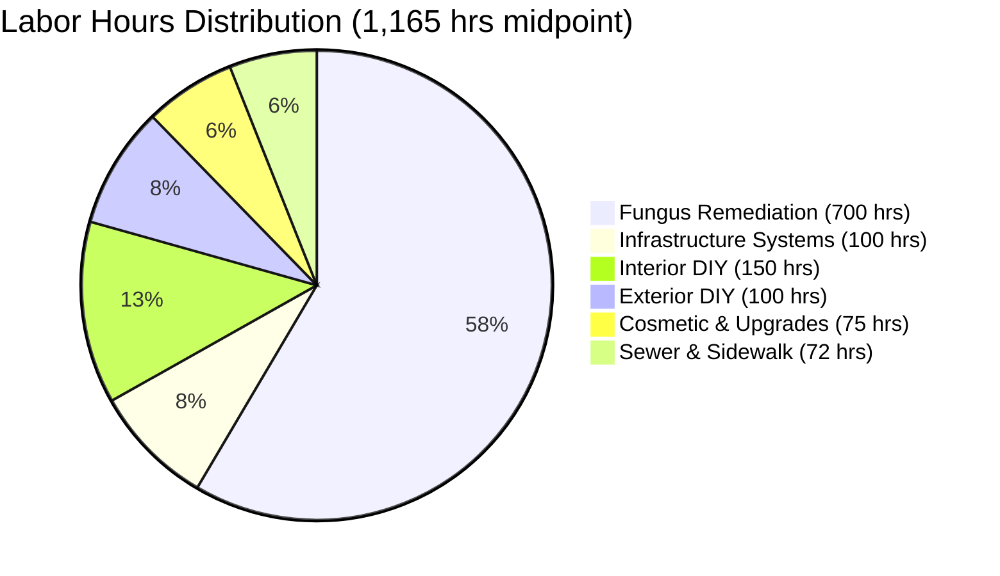

# Master Shopping List

This document consolidates ALL pending decisions, purchases, and rentals from various planning files, organized by category with complete tracking.

**Last Updated:** 2025-11-03

---

## TABLE OF CONTENTS

1. [Executive Summary](#executive-summary)
2. [Labor Hours & Timeline Analysis](#labor-hours--timeline-analysis)
3. [SECTION 1: TOOLS](#section-1-tools)
4. [SECTION 2: MATERIALS](#section-2-materials)
5. [SECTION 3: PENDING DECISIONS](#section-3-pending-decisions)
6. [SECTION 4: RENTAL EQUIPMENT](#section-4-rental-equipment)

---

## EXECUTIVE SUMMARY

### Total Investment Summary

| Category | Estimated Cost | Status |
|----------|---------------|--------|
| **Tools** | $6,100-9,600 | Planning |
| **Fungus Remediation Materials** | $12,700-13,200 | Planning |
| **Windows & Doors** | $5,400-6,500 | Partially ordered |
| **Electrical Materials** | $60-165 | Ready to purchase |
| **Plumbing Materials** | $30-60 | Ready to purchase |
| **HVAC Materials** | $20-40 | Ready to purchase |
| **Fire & Safety** | $30-60 | Ready to purchase |
| **Fasteners & Hardware** | $515-600 | Ready to purchase |
| **Paint & Finishing** | $200-350 | Ready to purchase |
| **Fans & Lighting** | $540-800 | Partially ordered |
| **Ceiling Fan Electrical** | $95-586 | Ready to purchase |
| **Miscellaneous Supplies** | $150-250 | Ready to purchase |
| **GRAND TOTAL** | **$25,840-33,211** | **In Progress** |

### High-Level Time Investment

| Metric | Estimate | Notes |
|--------|----------|-------|
| **Total Labor Hours** | **1,000-1,350 hrs** | Midpoint: ~1,165 hours |
| **Calendar Duration** | **14-20 weeks** | 3.5-5 months including permits, weather, cure times |
| **Full-Time Equivalent** | **6-8 months** | If working solo, 20-25 hrs/week |
| **Weekend Warrior** | **12-16 months** | If working 10 hrs/week (Sat/Sun) |

**See [Labor Hours & Timeline Analysis](#labor-hours--timeline-analysis) below for detailed breakdown.**

---

## LABOR HOURS & TIMELINE ANALYSIS

**Reference:** See [@planning/master-repair-plan.md](master-repair-plan.md) for comprehensive labor hours breakdown.

### Detailed Labor Hours by Category

| Category | Labor Hours | Crew Size | Calendar Days | Cost @ $25/hr | DIY or Contractor | Notes |
|----------|-------------|-----------|---------------|---------------|-------------------|-------|
| **🐛 Fungus Remediation** | **700 hrs** | 1-2 person | 73 days (solo) | **$17,500** | DIY | Revised from 528 hrs after comprehensive analysis |
| **🚨 Sewer Lateral** | 40-50 hrs | 2-person crew | 2 days | $4,500-5,000 | Contractor | CRITICAL - property transfer |
| **🚨 Sidewalk Repairs** | 24-30 hrs | 2-person crew | 2-3 days | $3,000-3,500 | Contractor | CRITICAL - ADA compliance |
| **⚡ Electrical Systems** | 40-60 hrs | 1 person | 5-8 days | $1,000-1,500 | Mixed (DIY safety + contractor subpanel) |
| **🔧 HVAC Systems** | 20-30 hrs | 1 person + contractor | 3-5 days | $500-750 | Mixed (DIY vent + contractor furnace) |
| **💧 Plumbing Systems** | 20-30 hrs | 1 person + contractor | 3-5 days | $500-750 | Mixed (DIY P-traps + contractor leaks) |
| **🏠 Interior DIY** | 120-180 hrs | 1 person | 15-23 days | $3,000-4,500 | DIY | Drywall, painting, doors, flooring |
| **🏡 Exterior DIY** | 80-120 hrs | 1 person | 10-15 days | $2,000-3,000 | DIY | Stucco, caulking, drainage, grading |
| **🎨 Cosmetic & Upgrades** | 60-90 hrs | 1 person | 8-12 days | $1,500-2,250 | DIY | Floor refinishing, paint touch-ups, screens |
| **📋 Planning & Permits** | 40-60 hrs | 1 person | Ongoing | $1,000-1,500 | DIY | Research, permit applications, inspections |
| **TOTAL** | **1,144-1,350 hrs** | **Mixed** | **121-176 work days** | **$34,500-44,250** | **Mixed** | Plus materials & contractor markups |

### Timeline Breakdown: Work Hours vs Calendar Days

**Critical Understanding:** Work hours ≠ calendar days due to:
- Building permit processing: 10-15 business days
- Concrete cure times: 24-72 hours (sidewalk, porch foundations)
- Stucco cure times: 24-48 hours between coats
- Weather delays: Rain impacts 40% of project (exterior work)
- Inspection scheduling: 1-3 days notice required
- Material delivery delays: 3-7 days for lumber orders
- DIY learning curve: 2-3x longer than professional work

| Phase | Work Hours | Calendar Duration | Key Constraints |
|-------|------------|-------------------|-----------------|
| **Phase 1: Property Transfer** | 65-80 hrs | 5-7 days | CRITICAL PATH - cannot close escrow without completion |
| **Phase 2: Fungus Remediation** | 700 hrs | 10-14 weeks | Weather dependent, building permit (2-3 weeks processing) |
| **Phase 3: Infrastructure** | 80-120 hrs | 3-5 weeks | Some concurrent with Phase 2, contractor scheduling |
| **Phase 4: Interior DIY** | 120-180 hrs | 4-6 weeks | Can work during rain, some concurrent with Phase 2 |
| **Phase 5: Cosmetic** | 60-90 hrs | 2-4 weeks | After all structural work complete |

**Realistic Timeline:** **14-20 weeks total** (3.5-5 months) with overlapping work and efficient scheduling

### Work Intensity Scenarios

| Scenario | Hours/Week | Total Weeks | Monthly Cost Impact | Feasibility |
|----------|------------|-------------|---------------------|-------------|
| **Full-Time DIY** | 40 hrs | 25-34 weeks | No income loss | High intensity, requires savings |
| **Part-Time Intensive** | 20-25 hrs | 46-68 weeks | Limited income loss | Sustainable, ~1 year |
| **Weekend Warrior** | 10 hrs | 100-135 weeks | No income loss | Low intensity, 2+ years |
| **Hybrid (DIY + Contractors)** | 15 hrs DIY | 30-40 weeks | Higher upfront cost | Recommended balance |

### Critical Path Items (Cannot Parallelize)

These tasks MUST be done sequentially and define minimum project duration:

1. **Property Transfer Compliance** (Week 1): Sewer lateral + sidewalk → 5-7 days
2. **Building Permit Processing** (Weeks 2-3): Submit, review, approve → 10-15 business days
3. **Fungus Demolition Phase** (Weeks 4-6): Remove damaged wood → 3 weeks
4. **TIM-BOR Treatment** (Week 7): Apply + 12-24 hr dry time → 3-5 days
5. **Fungus Rebuild Phase** (Weeks 8-13): Framing, decks, windows → 6 weeks
6. **Fungus Finishing Phase** (Weeks 14-16): Stucco, paint, trim → 3 weeks
7. **Final Inspections** (Week 17): Schedule + corrections → 1 week

**Minimum Timeline:** 17 weeks even with perfect execution and no delays

### Cost Validation: Labor Hours Match Quoted Prices

| Item | Quoted Cost | Implied Labor Hours | Hourly Rate | Validation |
|------|-------------|---------------------|-------------|------------|
| Sewer Lateral | $6,900 | 40-50 hrs (2-person crew) | $69-86/hr crew rate | ✅ Matches industry ($65-100/hr for 2-person crew) |
| Sidewalk | $5,800 | 24-30 hrs (2-person crew) | $97-121/hr crew rate | ✅ Matches ADA compliance work ($80-150/hr) |
| Fungus (DIY) | $56,667 total | 700 hrs @ $25/hr = $17,500 labor | $25/hr solo DIY | ✅ Materials ($38,364) + labor ($17,500) + permits ($6,950) |

### Status Legend
- ✅ **Purchased** - Item acquired
- 📦 **Ordered/Shipping** - Order placed, awaiting delivery
- ⏳ **Pending Decision** - Selection or measurement needed
- 🛒 **Ready to Purchase** - Ready to buy
- ❌ **Not Needed** - Item no longer required
- 🔄 **Already Owned** - Have in inventory

---

## SECTION 1: TOOLS

**Reference:** See [@planning/tools/tool-bom.md](tools/tool-bom.md) for complete specifications, models, and detailed analysis.

### PHASE 1: Universal Tools ($800-1,200)
**Priority:** CRITICAL - Must purchase before ANY project start

| Item | Model | Vendor | Cost | Status | Projects Used | Buy/Rent | Notes |
|------|-------|--------|------|--------|---------------|----------|-------|
| **Ryobi ONE+ 6-Tool Combo Kit** | P1819 | Home Depot | $199 | ✅ | ALL 7 projects | Buy | Drill, impact driver, recip saw, circular saw, multi-tool, LED light + 2 batteries |
| **Extra 4.0Ah Battery** | PBP2004 | Home Depot | $79 | ✅ | Extended sessions | Buy | More runtime |
| **Ryobi ONE+ Jigsaw** | PCL525B | Home Depot | $59 | ✅ | Interior, Fungus | Buy | Curved cuts |
| **Recip Saw Blades Multi-Pack** | Diablo DS0014S | Home Depot | $40 | ✅ | Interior, Fungus | Buy | Wood + metal |
| **Circular Saw Blades Combo** | Diablo PCD076060241 | Home Depot | $60 | ✅ | Interior, Fungus | Buy | 24T framing + 60T finish |

**Phase 1 Subtotal: $437**

### PHASE 2: Electrical Safety Tools ($108)
**Priority:** CRITICAL - Cannot skip, life safety

| Item | Model | Vendor | Cost | Status | Safety Level | Buy/Rent | Notes |
|------|-------|--------|------|--------|--------------|----------|-------|
| **Non-Contact Voltage Tester** | Klein NCVT-1SEN | Home Depot | $25 | ✅ | **LIFE SAFETY** | Buy | Electrocution prevention |
| **Wire Strippers/Cutters** | Klein 11057 | Home Depot | $35 | ✅ | Code compliance | Buy | Proper wire connections |
| **Needle-Nose Pliers** | Klein D203-8 | Home Depot | $25 | ✅ | Wire manipulation | Buy | Tight spaces |
| **Electrical Tape** | 3M Super 33+ | Home Depot | $8 x 2 | ✅ | Code compliance | Buy | UL listed |
| **Wire Nuts Assortment** | Ideal In-Sure 30-1034P | Home Depot | $15 | ✅ | Secure connections | Buy | Various sizes |

**Phase 2 Subtotal: $108**

### PHASE 3: Basic Hand Tools ($300-450)

| Item | Model | Vendor | Cost | Status | Usage | Buy/Rent | Notes |
|------|-------|--------|------|--------|-------|----------|-------|
| **Extension Ladder 24'** | Werner D7124-2 | Home Depot | $189 | 🔄 | Exterior | Buy | Already owned |
| **Caulking Gun** | Newborn 930-GTD | Home Depot | $15 | 🔄 | Exterior | Buy | Already owned |
| **Wire Brush** | Weiler 44006 | Home Depot | $12 | ✅ | Surface prep | Buy | Paint removal |
| **Putty Knife Set 4-pc** | Hyde 45750 | Home Depot | $28 | ✅ | Surface prep | Buy | Various sizes |
| **Drywall Knife Set** | Hyde Pro 42090 | Home Depot | $45 | ✅ | Drywall patching | Buy | 2", 4", 6" |
| **Sanding Block** | 3M 9292NA | Home Depot | $8 | ✅ | Surface prep | Buy | Even pressure |
| **Paint Brush Set** | Purdy XL 140843000 | Home Depot | $55 | ✅ | Painting | Buy | Quality finish |
| **Paint Roller Kit** | Wooster Big Ben R017-18 | Home Depot | $25 | ✅ | Painting | Buy | Fast coverage |
| **Canvas Drop Cloths 9x12** | Everbilt 912HD-8 | Home Depot | $35 x 2 | ✅ | Floor protection | Buy | Washable |
| **Channel-Lock Pliers 10"** | Channellock 430 | Home Depot | $25 | ✅ | Plumbing | Buy | Pipe fitting |
| **Plumber's Putty** | Oatey 311662 | Home Depot | $8 | ✅ | Plumbing | Buy | Sealing |
| **Teflon Tape** | Oatey 31273 | Home Depot | $3 x 2 | ✅ | Plumbing | Buy | Thread sealing |

**Phase 3 Subtotal: $254** (✓ $204 savings from owned tools)

### PHASE 4: Fungus Remediation Tools ($1,800-2,400)
**Priority:** CRITICAL for structural work

#### Demolition & Removal Tools

| Item | Model | Vendor | Cost | Status | Application | Buy/Rent | Notes |
|------|-------|--------|------|--------|-------------|----------|-------|
| **Pry Bar 24"** | Estwing E3-24 | Amazon | $35 | ✅ | Demo | Buy | Essential |
| **Pry Bar 36"** | Estwing E3-36 | Amazon | $55 | ✅ | Heavy demo | Buy | Extra leverage |
| **Cat's Paw Nail Puller** | Stanley 55-515 | Home Depot | $20 | ✅ | Nail extraction | Buy | Save lumber |
| **Sledge Hammer 3lb** | Estwing B3-3LB | Home Depot | $50 | ✅ | Heavy demo | Buy | Controlled power |
| **Wire Brush Set 3-pc** | Generic | Amazon | $20 | ✅ | **TIM-BOR CRITICAL** | Buy | Surface cleaning |
| **Paint Scraper Set 4-pc** | Husky 4PWC-WSC | Home Depot | $28 | ✅ | **TIM-BOR CRITICAL** | Buy | Paint removal |

#### Measuring & Layout Tools

| Item | Model | Vendor | Cost | Status | Application | Buy/Rent | Notes |
|------|-------|--------|------|--------|-------------|----------|-------|
| **Tape Measure 100'** | Stanley 34-790 | Home Depot | $45 | ✅ | Long measurements | Buy | Porch/deck |
| **Speed Square 7"** | Swanson S0101 | Home Depot | $15 | ✅ | **MOST VERSATILE** | Buy | Daily use |
| **Speed Square 12"** | Swanson Big 12 | Home Depot | $30 | ✅ | Structural work | Buy | Large layouts |
| **Level 24"** | Stabila Type 196-2 | Amazon | $75 | ✅ | Professional accuracy | Buy | Daily use |
| **Level 48"** | Stabila Type 196-2 | Amazon | $125 | ✅ | Long spans | Buy | Structural |
| **Carpenter's Square** | Johnson CS5 | Home Depot | $32 | ✅ | Large assemblies | Buy | Door/window frames |
| **Chalk Line** | Irwin Strait-Line 64498 | Home Depot | $20 | ✅ | Siding layout | Buy | Long cuts |
| **Combination Square 12"** | Starrett C11H-12-4R | Amazon | $50 | ✅ | Precision work | Buy | 45°/90° marking |

#### Inspection & Assessment Tools

| Item | Model | Vendor | Cost | Status | Application | Buy/Rent | Notes |
|------|-------|--------|------|--------|-------------|----------|-------|
| **Moisture Meter** | General Tools MMD4E | Amazon | $45 | ✅ | **TIM-BOR ESSENTIAL** | Buy | Verify wood dryness |
| **LED Flashlight** | Streamlight 88061 ProTac | Amazon | $50 | ✅ | Inspection | Buy | 350 lumens |
| **Inspection Mirror** | SE MTE914 | Amazon | $18 | ✅ | Hidden areas | Buy | See around corners |
| **Awl/Pick Set 4-pc** | General Tools 88CM | Home Depot | $15 | ✅ | Wood integrity test | Buy | Probe soft spots |

#### Structural Support Tools

| Item | Model | Vendor | Cost | Status | Application | Buy/Rent | Notes |
|------|-------|--------|------|--------|-------------|----------|-------|
| **Adjustable Steel Posts 3-pk** | Akron 11430 | Home Depot | $200 | 🛒 | **SAFETY CRITICAL** | Buy | Support during repairs |
| **Wood Shims** | Nelson Wood 10012992 | Home Depot | $35 x 2 | 🛒 | **ESSENTIAL** leveling | Buy | Constant use |
| **Composite Wedge Set** | Generic | Amazon | $20 | 🛒 | Positioning | Buy | Assembly aid - NEED TO GET |

#### Surface Preparation Tools

| Item | Model | Vendor | Cost | Status | Application | Buy/Rent | Notes |
|------|-------|--------|------|--------|-------------|----------|-------|
| **Random Orbital Sander** | DeWalt DWE6423K | Home Depot | $110 | ✅ | **TIM-BOR REQUIRED** | Buy | Surface prep |
| **Sanding Discs Variety** | DeWalt DWAS50080 | Home Depot | $45 | ✅ | Multiple grits | Buy | 80, 120, 220 |
| **Steel Wool Pack** | Generic | Amazon | $18 | ✅ | Fine surface prep | Buy | Detail work |

#### Work Support & Clamping

| Item | Model | Vendor | Cost | Status | Application | Buy/Rent | Notes |
|------|-------|--------|------|--------|-------------|----------|-------|
| **Sawhorses 2-pk** | DeWalt DWST11001 | Home Depot | $100 | ✅ | **ESSENTIAL** cutting | Buy | 1,000 lb capacity |
| **Portable Work Bench** | Keter 197283 | Amazon | $150 | ✅ | Assembly | Buy | Clamps built-in |
| **Bar Clamps 6"** | Bessey KRE3506 (2) | Amazon | $50 | 🛒 | Small assemblies | Buy | 600 lb force - NEED |
| **Bar Clamps 12"** | Bessey KRE3512 (2) | Amazon | $70 | 🛒 | Medium work | Buy | 600 lb force - NEED |
| **Bar Clamps 24"** | Bessey KRE3524 (2) | Amazon | $100 | 🛒 | Door frames | Buy | 600 lb force - NEED |
| **Bar Clamps 36"** | Bessey KRE3536 (2) | Amazon | $130 | 🛒 | Porch structures | Buy | 600 lb force - NEED |
| **C-Clamps 2"** | Pony Jorgensen 3202 (2) | Home Depot | $25 | 🛒 | Bench work | Buy | Cast iron - NEED |
| **C-Clamps 4"** | Pony Jorgensen 3204 (2) | Home Depot | $35 | 🛒 | Medium tasks | Buy | Versatile - NEED |

#### Fastening Tools

| Item | Model | Vendor | Cost | Status | Application | Buy/Rent | Notes |
|------|-------|--------|------|--------|-------------|----------|-------|
| **Finish Hammer 16oz** | Estwing E16C | Home Depot | $35 | ✅ | Precision work | Buy | Smooth face |
| **Nail Sets 3-pc** | Stanley 58-930 | Home Depot | $12 | ✅ | Professional finish | Buy | Set finish nails |
| **Extra Batteries 2-pk** | DeWalt DCB204-2 20V | Home Depot | $120 | ✅ | Keep tools running | Buy | 4.0Ah capacity |
| **Drill Bit Set 14-pc** | DeWalt DW1354 | Home Depot | $25 | ✅ | Pilot holes | Buy | Titanium coated |
| **Driver Bit Set 40-pc** | DeWalt DWA2T40IR | Home Depot | $30 | ✅ | All screw types | Buy | Phillips, Torx, etc. |

**Phase 4 Subtotal: $2,268**

### PHASE 5: Professional Upgrade Tools ($1,500-2,500) - OPTIONAL

| Item | Model | Vendor | Cost | Status | Application | Buy/Rent | Notes |
|------|-------|--------|------|--------|-------------|----------|-------|
| **Framing Nailer** | DeWalt DCN21PLM1 | Home Depot | $400 | ⏳ | 10x faster nailing | Buy | Battery powered - MAYBE LATER |
| **Miter Saw 12"** | DeWalt DWS779 | Home Depot | $500 | ⏳ | Precise crosscuts | Rent | Rent for trim phase |
| **Finish Nailer** | DeWalt DCN650M1 | Amazon | $250 | ⏳ | Trim installation | Buy | Battery, 16ga |
| **Block Plane** | Stanley 12-960 | Amazon | $45 | ✅ | Fine-tune fit | Buy | Essential for doors |
| **Chisel Set 4-pc** | Narex 8116 | Amazon | $80 | ✅ | Hinge mortises | Buy | Professional joinery |
| **Socket Set 320-pc** | Craftsman | Amazon | $120 | ⏳ | Heavy fasteners | Buy | SAE & metric |

**Phase 5 Subtotal: $1,395**

### **TOTAL TOOLS INVESTMENT: $4,462-6,762**

---

## SECTION 2: MATERIALS

### A. FUNGUS REMEDIATION MATERIALS

#### Chemical Treatment Supplies

| Item | Specifications | Vendor | Quantity | Unit Cost | Total Cost | Status | Notes |
|------|---------------|--------|----------|-----------|------------|--------|-------|
| **TIM-BOR Professional** | 25 lb pail | DoMyOwn.com / Amazon | 1 pail | $110-120 | $110-120 | ✅ | Covers ~3,750 sq ft |
| **Ryobi ONE+ Backpack Sprayer** | P2840 4-gallon | Home Depot | 1 unit | $99-120 | $99-120 | ✅ | Uses existing ONE+ batteries |

**Subtotal Chemical Equipment: $209-240**

#### Safety Equipment (PPE)

| Item | Specifications | Vendor | Quantity | Unit Cost | Total Cost | Status | Notes |
|------|---------------|--------|----------|-----------|------------|--------|-------|
| **P100 Respirator Filters** | Cartridge pairs | Amazon | 6 pairs | $10/pair | $60 | ✅ | **REQUIRED for TIM-BOR** |
| **Nitrile Gloves** | Chemical resistant, extended cuff | Amazon / Home Depot | 10 pairs | $2.50/pair | $25 | ✅ | TIM-BOR compatible |
| **Safety Goggles** | Chemical splash protection | Home Depot | 1 pair | $10-15 | $10-15 | ✅ | Eye protection |
| **Heavy Plastic Drop Cloths** | **6 mil thickness** (critical) | Home Depot | 3 rolls 20'x25' | $15/roll | $45 | ✅ | Chemical resistant |
| **Canvas Drop Cloths** | 12 oz, 9'x12' | Home Depot | 4 pieces | $20 | $80 | ✅ | Washable, indoor |

**Subtotal Safety Equipment: $220-225**

#### Mixing & Application Supplies

| Item | Specifications | Vendor | Quantity | Unit Cost | Total Cost | Status | Notes |
|------|---------------|--------|----------|-----------|------------|--------|-------|
| **5-Gallon Mixing Bucket** | Heavy duty | Home Depot | 1 | $5-10 | $5-10 | ✅ | Mix before spraying |
| **Paint Mixing Paddle** | For drill | Home Depot | 1 | $5-10 | $5-10 | ✅ | Thorough mixing |
| **Measuring Cup 2-qt** | Clear graduated | Amazon | 1 | $5-10 | $5-10 | ✅ | Accurate ratios |
| **Large Funnel** | Chemical resistant | Home Depot | 1 | $3-5 | $3-5 | ✅ | Transfer to sprayer |
| **32oz Spray Bottle** | For detail work | Home Depot | 1 | $5-10 | $5-10 | ✅ | Touch-ups |

**Subtotal Mixing Supplies: $23-45**

#### Lumber & Structural Materials

**Reference:** See [@planning/diy/fungus-water-damage-specifications/fungus-water-damage-specifications.md](diy/fungus-water-damage-specifications/fungus-water-damage-specifications.md) Wood BOM section (lines 801-1209) for complete quantities.

| Category | Specifications | Vendor | Total Cost | Status | Notes |
|----------|---------------|--------|------------|--------|-------|
| **Structural Framing** | PT SYP #2, Ground Contact (2x4-4x6) | Home Depot | $2,231.50 | ✅ | 1,158 board feet |
| **Deck & Porch Materials** | PT SYP joists, decking, stairs | Home Depot | $2,376.00 | ✅ | 1,530 board feet |
| **Siding Materials** | T1-11 panels + PT trim | Home Depot | $1,264.00 | 🛒 | 600 sq ft coverage - NEED |
| **Subflooring** | CDX plywood, T&G OSB | Home Depot | $784.00 | 🛒 | 576 sq ft - NEED |
| **Window Materials** | Select Pine sash stock, glazing | Home Depot | $2,430.00 | 🛒 | 15 window units - NEED |
| **French Door Materials** | Select Pine, PT sills | Home Depot | $1,953.00 | ✅ | 3 door sets |
| **Railings & Balusters** | Cedar/Redwood handrails, PT posts | Home Depot | $640.00 | ✅ | Stairs & decks |
| **Blocking & Misc Lumber** | PT blocking, furring, shims | Home Depot | $467.50 | ✅ | Utility wood |

**Subtotal Lumber: $12,146.00**

**TOTAL FUNGUS REMEDIATION MATERIALS: $12,598-12,656**

---

### B. WINDOWS & DOORS

| Item | Product/Link | Location | Size | Vendor | Quantity | Price | Status | Notes |
|------|-------------|----------|------|--------|----------|-------|--------|-------|
| **Bay Vinyl Window** | [JELD-WEN V-4500](https://www.homedepot.com/p/JELD-WEN-71-5-in-x-59-5-in-V-4500-Bay-Vinyl-Window-THDJW244000003/316814359) | Small Bedroom | 71.5" x 59.5" | Home Depot | 1 | $1,918.00 | 🛒 | To be ordered |
| **Sliding Patio Door** | [MP Doors 60x80 Composite](https://www.homedepot.com/p/MP-Doors-60-in-x-80-in-Smooth-White-Right-Hand-Composite-Sliding-Patio-Door-G6068R002W/206872394) | Rear Patio & Smaller studio | 60" x 80" | Home Depot | 1 | $1,557.00 | ✅ | Purchased - replaces French door in studio |
| **Double French Door** | Existing door to refinish | Larger 1-bedroom unit | 72" x 80" | N/A | 1 | $0 | ✅ | Using existing door - will sand down and refinish |
| **Interior Door Slab** | 2-panel solid wood | Large corner bedroom | 30" x 80" | Urban Ore / Home Depot | 1 | $150-200 | ⏳ | Pending selection |
| **Side French Door Threshold** | M-D Adjustable | Side entrance | 4.5" or 5.625" depth | Home Depot | 1 | $136-180 | ✅ | Purchased |

**TOTAL WINDOWS & DOORS: $3,761-5,855** (pending decisions)

---

### C. ELECTRICAL MATERIALS

| Item | Specifications | Vendor | Quantity | Unit Cost | Total Cost | Status | Priority | Notes |
|------|---------------|--------|----------|-----------|------------|--------|----------|-------|
| **Receptacle Cover Plates** | Standard duplex | Home Depot | 2 | $2-3 | $4-6 | 🛒 | 🔴 CRITICAL | Kitchen, bedroom closet |
| **15A Duplex Receptacle** | Tamper-Resistant (TR) | Home Depot | 1 | $10-20 | $10-20 | 🛒 | 🔴 CRITICAL | Dining room replacement |
| **Junction Box Cover 4"** | Metal/plastic | Home Depot | 1 | $5-15 | $5-15 | 🛒 | 🔴 CRITICAL | Attic |
| **Surface-Mounted Raceway** | Legrand Wiremold kit | Home Depot | 1 kit | $25-50 | $25-50 | 🛒 | 🔴 CRITICAL | Utility room & stairwell |
| **GFCI Receptacles** | 15A TR, WR for exterior | Home Depot | 2 | $20 | $40 | 🛒 | 🔴 CRITICAL | Kitchen & rear exterior |

**TOTAL ELECTRICAL MATERIALS: $84-131**

---

### D. PLUMBING MATERIALS

| Item | Specifications | Vendor | Quantity | Unit Cost | Total Cost | Status | Priority | Notes |
|------|---------------|--------|----------|-----------|------------|--------|----------|-------|
| **P-Trap Assemblies** | PVC/ABS, 1.25" or 1.5" | Home Depot | 2 | $15-30 | $30-60 | 🛒 | 🟢 MEDIUM | 1/2 bath & lower bath |
| **Extra Washers/Gaskets** | Rubber slip-joint | Home Depot | 1 pack | $5-10 | $5-10 | 🛒 | 🟢 MEDIUM | Replacement parts |
| **Plumber's Putty** | Oatey 311662 | Home Depot | 1 | $8 | $8 | 🛒 | 🟢 MEDIUM | Already in hand tools |
| **Teflon Tape** | Oatey 31273 | Home Depot | 2 | $3 | $6 | 🛒 | 🟢 MEDIUM | Already in hand tools |

**TOTAL PLUMBING MATERIALS: $49-84**

---

### E. HVAC MATERIALS

| Item | Specifications | Vendor | Quantity | Unit Cost | Total Cost | Status | Priority | Notes |
|------|---------------|--------|----------|-----------|------------|--------|----------|-------|
| **Semi-Rigid Aluminum Duct** | UL 2158A, 4" x 8' | Home Depot | 1 | $15-25 | $15-25 | 🛒 | 🔴 CRITICAL | Dryer vent |
| **Metal Worm-Drive Clamps** | 4-inch | Home Depot | 2 | $1.50-2.50 | $3-5 | 🛒 | 🔴 CRITICAL | Secure connections |
| **Foil Tape** | For backup connections | Home Depot | 1 | $3-5 | $3-5 | 🛒 | 🔴 CRITICAL | Extra security |

**TOTAL HVAC MATERIALS: $21-35**

---

### F. FIRE & SAFETY MATERIALS

| Item | Specifications | Vendor | Quantity | Unit Cost | Total Cost | Status | Priority | Notes |
|------|---------------|--------|----------|-----------|------------|--------|----------|-------|
| **CO Detectors** | 10-year sealed battery | Home Depot / Amazon | 2 | $15-30 | $30-60 | 🛒 | 🔴 CRITICAL | Lower unit & in-law |

**TOTAL FIRE & SAFETY: $30-60**

---

### G. FASTENERS & HARDWARE

| Item | Specifications | Vendor | Quantity | Unit Cost | Total Cost | Status | Notes |
|------|---------------|--------|----------|-----------|------------|--------|-------|
| **Framing Screws** | Simpson #9 x 2.5", 3", 3.5" | Home Depot | 5 lbs each size | ~$20/lb | $100 | 🛒 | Structural grade, coated |
| **Lag Bolts** | 1/2" x 6", 8", 10" galvanized | Home Depot | 20 each size | ~$1.33 | $80 | 🛒 | Hot-dip galvanized |
| **Carriage Bolts** | 1/2" x 8", 10" w/ nuts/washers | Home Depot | 10 each size | ~$2.75 | $55 | 🛒 | Galvanized, hex nuts |
| **Joist Hangers** | Simpson A35 2x6, 2x8, 2x10 | Home Depot | 20 each size | ~$1.42 | $85 | 🛒 | Galvanized |
| **Post Anchors** | Simpson ABA44Z or CB44 | Home Depot | 8-12 pieces | ~$12 | $120 | 🛒 | Match post size |
| **Construction Adhesive** | Liquid Nails LN-901 | Home Depot | 12 tubes | ~$5.83 | $70 | 🛒 | Weather resistant |

**TOTAL FASTENERS & HARDWARE: $510**

---

### H. PAINT & FINISHING SUPPLIES

| Item | Specifications | Vendor | Quantity | Unit Cost | Total Cost | Status | Notes |
|------|---------------|--------|----------|-----------|------------|--------|-------|
| **Paint Brush Set** | Purdy XL Series 140843000 | Home Depot | 1 set | $55 | $55 | 🛒 | Already in tools list |
| **Paint Roller Kit** | Wooster Big Ben R017-18 | Home Depot | 1 kit | $25 | $25 | 🛒 | Already in tools list |
| **Canvas Drop Cloths 9x12** | Everbilt 912HD-8 | Home Depot | 2 | $35 | $70 | 🛒 | Already in tools list |
| **Spackle/Joint Compound** | Lightweight, interior | Home Depot | 1 gallon | $15-20 | $15-20 | 🛒 | Drywall repair |
| **Fine-Grit Sandpaper** | 120-220 grit assortment | Home Depot | 1 pack | $10-15 | $10-15 | 🛒 | Surface prep |
| **Primer** | Interior/exterior | Home Depot / Sherwin Williams | 2 gallons | $25-35 | $50-70 | 🛒 | Seal repairs |
| **Paint** | Interior/exterior topcoat | Home Depot / Sherwin Williams | TBD | TBD | TBD | ⏳ | Pending color selection |

**TOTAL PAINT & FINISHING: $225-305** (paint TBD)

---

### I. CAULK & SEALANTS

| Item | Specifications | Vendor | Quantity | Unit Cost | Total Cost | Status | Notes |
|------|---------------|--------|----------|-----------|------------|--------|-------|
| **Exterior Caulk** | DAP Dynaflex 230 | Home Depot | 3 tubes | $8 | $24 | 🛒 | 50-year formula |
| **Interior Caulk** | Paintable, low-VOC | Home Depot | 2 tubes | $5-7 | $10-14 | 🛒 | Window/door trim |
| **Weatherstripping** | Adhesive-backed foam | Home Depot | 2 rolls | $8-12 | $16-24 | 🛒 | Door/window sealing |

**TOTAL CAULK & SEALANTS: $50-62**

---

### J. FANS & LIGHTING

| Item | Product/Link | Location | Vendor | Quantity | Price | Status | Notes |
|------|-------------|----------|--------|----------|-------|--------|-------|
| **Mercury Row Trosclair 60" Fan** | [Wayfair Link](https://www.wayfair.com/lighting/pdp/mercury-row-trosclair-60-8-blade-reversible-dc-ceiling-fan-with-led-lights-and-remote-control-w009319631.html) | Small & Big Bedrooms | Wayfair | 2 | $269.99 each | 📦 | 2 of 3 arrived, follow up mid-Oct |
| **Living Room Ceiling Fan** | TBD >52" | Living Room | Wayfair | 1 | $200-400 | ⏳ | Measure room first |

**TOTAL FANS & LIGHTING: $540-940**

---

### K. CEILING FAN ELECTRICAL INSTALLATION

**Reference:** See [@planning/diy/ceiling-fan-electrical-installation.md](diy/ceiling-fan-electrical-installation.md) for complete installation guide.

**Installation Plan:** Fish cable from attic using ruler method, tap into existing ceiling light near door.

| Item | Specifications | Vendor | Quantity | Unit Cost | Total Cost | Status | Notes |
|------|---------------|--------|----------|-----------|------------|--------|-------|
| **14/2 NM-B Cable (Romex)** | With ground, 50 ft roll | Home Depot | 1 roll | $35-50 | $35-50 | 🛒 | Covers both fans |
| **Ceiling Fan Box & Brace** | Adjustable, 70+ lb rated | Home Depot | 2 | $15-25 | $30-50 | 🛒 | One per fan location |
| **Cable Staples** | For 14/2 NM cable | Home Depot | 1 box | $5-8 | $5-8 | 🛒 | Secure cable to joists |
| **Cable Ripper** | Strip NM cable jacket | Home Depot | 1 | $5-8 | $5-8 | 🛒 | Makes stripping easier |
| **Headlamp** | Hands-free attic lighting | Home Depot / Amazon | 1 | $20-50 | $20-50 | 🛒 | Essential for attic work |

**Optional - Depends on Control Method Choice:**

| Item | Specifications | Vendor | Quantity | Unit Cost | Total Cost | Status | Notes |
|------|---------------|--------|----------|-----------|------------|--------|-------|
| **Old-Work Switch Box** | Single-gang retrofit | Home Depot | 2 | $3-5 | $6-10 | ⏳ | Only if adding separate wall switch |
| **Single-Pole Switch** | 15A Decora style | Home Depot | 2 | $8-15 | $16-30 | ⏳ | Only if adding separate wall switch |
| **Switch Cover Plate** | Decora style | Home Depot | 2 | $2-3 | $4-6 | ⏳ | Only if adding separate wall switch |
| **Smart Fan Module** | Bond/Sonoff/compatible | Amazon | 2 | $50-150 | $100-300 | ⏳ | Only if using wireless smart switch |
| **Wireless Wall Switch** | Battery-powered | Amazon | 2 | $25-60 | $50-120 | ⏳ | Only if using wireless smart switch |

**TOTAL CEILING FAN ELECTRICAL:**
- **Base Materials (Required):** $95-166
- **Option A (Separate Wired Switch):** Add $26-46
- **Option C (Wireless Smart Switch):** Add $150-420

**GRAND TOTAL WITH OPTIONS:**
- **Simplest (shared switch with light):** $95-166
- **Wired separate switch:** $121-212
- **Wireless smart switch:** $245-586

---

### L. MISCELLANEOUS SUPPLIES

| Item | Specifications | Vendor | Quantity | Unit Cost | Total Cost | Status | Notes |
|------|---------------|--------|----------|-----------|------------|--------|-------|
| **Wire Brushes** | 3-piece variety | Amazon | 1 set | $20 | $20 | 🛒 | Already in fungus tools |
| **Paint Scrapers** | 4-piece set | Home Depot | 1 set | $28 | $28 | 🛒 | Already in fungus tools |
| **Wood Shims** | Cedar bundles | Home Depot | 2 bundles | $35 | $70 | 🛒 | Already in fungus tools |
| **Steel Wool Pack** | Various grades | Amazon | 1 pack | $18 | $18 | 🛒 | Already in fungus tools |
| **Composite Wedges** | Non-marring | Amazon | 1 set | $20 | $20 | 🛒 | Already in fungus tools |

**TOTAL MISCELLANEOUS: $156** (already in tool lists)

---

## SECTION 3: PENDING DECISIONS

These items require measurement, selection, or additional information before purchasing.

| Item | Decision Needed | Location | Estimated Cost | Notes |
|------|----------------|----------|----------------|-------|
| **Interior Door Slab** | Select 30"x80" 2-panel solid wood door | Large corner bedroom | $150-200 | Source from Urban Ore or Home Depot |
| **Side French Door Threshold** | Measure wall depth (2x4 = 4.5", 2x6 = 5.625") | Side entrance | $136-180 | ✅ Purchased |
| **Ceiling Fan - Living Room** | Measure room, select style >52" | Living Room | $200-400 | Confirm size needed |
| **Awning for Bay Window** | Select retractable awning model | Small bedroom bay window | TBD | Research specific model |
| **Double French Door** | ~~Finalize specifications 72"x80"~~ | Larger 1-bedroom unit | $0 | ✅ Using existing door - will sand down and refinish |
| **Sliding Glass Door** | ~~Finalize specifications 61"x80"~~ | Smaller studio | $1,557 | ✅ Using same 60"x80" sliding patio door already purchased |
| **Paint Colors** | Select interior/exterior colors | Various | TBD | After primer application |

---

## SECTION 4: RENTAL EQUIPMENT

These items are recommended for rental rather than purchase based on cost-benefit analysis.

| Item | Daily Rate (est.) | Purchase Cost | Project Days | Rent vs Buy Decision | Vendor | Notes |
|------|------------------|---------------|--------------|---------------------|--------|-------|
| **Table Saw** | $45 | $800 | 5 days | **Rent** ($225 vs $800) | Home Depot | Specific cutting tasks |
| **Large Air Compressor** | $30 | $400 | 10 days | **Rent** ($300 vs $400) | Home Depot | Pneumatic nailers |
| **Miter Saw 12"** | $35 | $500 | 7 days | **Rent** ($245 vs $500) | Home Depot | Trim phase |
| **House Jacks (2)** | $25 | $130 | 3 days | **Rent** ($75 vs $130) | Northern Tool | Lift structural elements |
| **Concrete Surface Grinder** | $75-90 | $2,500+ | 2-3 days | **Rent** ($150-270 vs $2,500) | Home Depot / United Rentals | Floor grinder/scarifier - levels uneven concrete |

**TOTAL RENTAL COST (estimated): $995-1,115** vs **$4,330+ purchase** = **Save $3,215-3,335**

---

## CATEGORY TOTALS SUMMARY

| Category | Cost Range | Status |
|----------|-----------|--------|
| **TOOLS** | $4,462-6,762 | Planning phase |
| **Fungus Remediation Materials** | $12,598-12,656 | Ready to order |
| **Windows & Doors** | $3,761-5,855 | Pending decisions |
| **Electrical Materials** | $84-131 | Ready to purchase |
| **Plumbing Materials** | $49-84 | Ready to purchase |
| **HVAC Materials** | $21-35 | Ready to purchase |
| **Fire & Safety** | $30-60 | Ready to purchase |
| **Fasteners & Hardware** | $510 | Ready to purchase |
| **Paint & Finishing** | $225-305 | Ready to purchase (paint TBD) |
| **Caulk & Sealants** | $50-62 | Ready to purchase |
| **Fans & Lighting** | $540-940 | Partially ordered |
| **Ceiling Fan Electrical** | $95-586 | Ready to purchase |
| **Rental Equipment** | $845 | As needed |

### **GRAND TOTAL: $23,270-29,321**

**Note:** This excludes items already listed in tool totals to avoid double-counting (e.g., drop cloths, brushes, wire brushes appear in both tools and fungus materials).

---

## PURCHASING STRATEGY

### Week 1: Critical Safety Items
**Budget: ~$200**
- CO detectors ($30-60)
- Electrical safety materials ($84-131)
- HVAC dryer vent ($21-35)

### Week 2: Basic Tools & Supplies
**Budget: ~$800**
- Ryobi ONE+ combo kit ($199)
- Electrical safety tools ($108)
- Basic hand tools ($254)
- Plumbing materials ($49-84)

### Week 3-4: Fungus Remediation Prep
**Budget: ~$2,500**
- Demolition tools ($208)
- Measuring tools ($392)
- Inspection tools ($128)
- TIM-BOR equipment ($209-240)
- Safety equipment ($220-225)

### Month 2: Major Materials Order
**Budget: ~$15,000**
- Lumber packages ($12,146)
- Windows & doors (finalize decisions)
- Fasteners & hardware ($510)
- Paint & finishing ($225-305)

### Month 3+: Project-Specific
- Rental equipment as needed
- Remaining specialized tools
- Paint (after color selection)

---

## VENDOR CONTACT INFORMATION

### Primary Vendors

**Home Depot**
- Online: homedepot.com
- Pro Account: Recommended for contractor pricing
- Delivery: Available for large orders

**Amazon**
- Prime: Essential for fast delivery
- Best for: Specialty tools, small items

**Wayfair**
- Fans & lighting
- Online ordering

**DoMyOwn.com**
- TIM-BOR and pest control supplies
- Specialty chemicals

**Urban Ore (Berkeley)**
- Salvaged/reclaimed materials
- 900 Murray St, Berkeley, CA
- For: Interior door slab option

---

## NOTES & IMPORTANT REMINDERS

1. **Tool BOM Reference**: Complete detailed tool specifications in [@planning/tools/tool-bom.md](tools/tool-bom.md)

2. **Fungus Materials**: Complete wood quantities and specifications in [@planning/diy/fungus-water-damage-specifications/fungus-water-damage-specifications.md](diy/fungus-water-damage-specifications/fungus-water-damage-specifications.md)

3. **TIM-BOR Requirements**:
   - Must be applied by licensed pest control operator in some jurisdictions
   - Wood must be dry before application (verify with moisture meter)
   - Requires P100 respirator and chemical-resistant gear

4. **Code Compliance**:
   - CO detectors required by CA law
   - Electrical work must meet NEC standards
   - Building permits required for structural work

5. **Measurement Required Before Purchase**:
   - Side French door threshold (wall depth)
   - Living room ceiling fan (room size)
   - Paint quantities (after primer)

6. **Already Owned Items** (savings):
   - Extension ladder 24' ($189)
   - Caulking gun ($15)

7. **Price Updates**: Lumber prices fluctuate daily. Verify current pricing before large orders.

---

**Last Updated:** 2025-11-03
**Next Review:** After completing pending measurements and decisions
